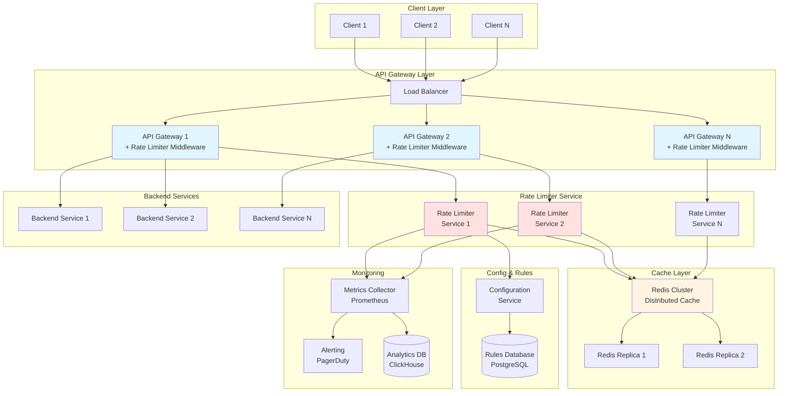
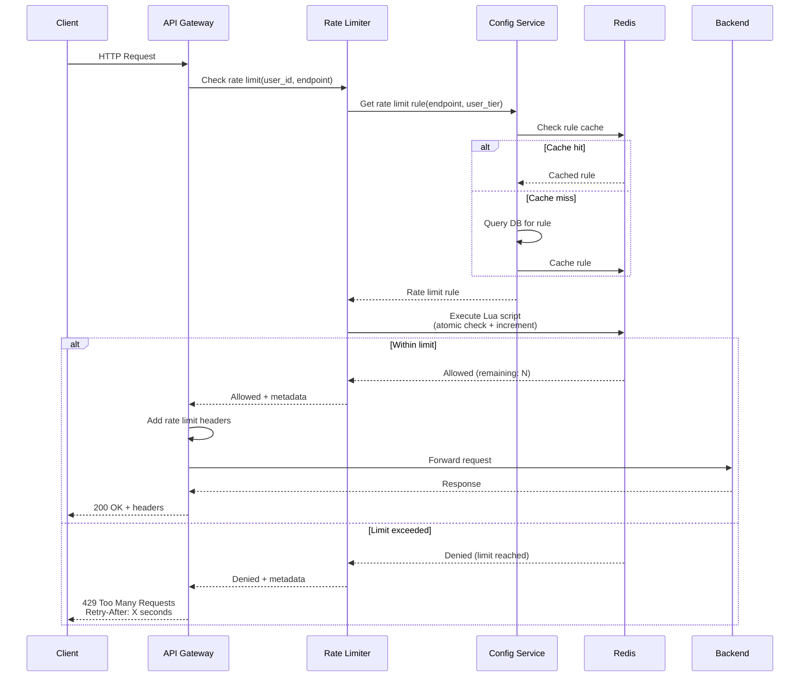

# Design Rate Limiter

## Problem Statement

Design a scalable rate limiter that can throttle requests to prevent abuse, ensure fair resource allocation, and protect backend services from overload. The rate limiter should support multiple algorithms, be distributed across multiple servers, and have low latency overhead.

**Difficulty:** Medium

**Prerequisites:** Distributed Systems, Caching, Sliding Window Algorithms

---

## Step 1: Requirements & Scope

### Functional Requirements

**Core Features:**

1. **Request Throttling**
   - Limit requests per user/IP/API key
   - Support multiple time windows (second, minute, hour, day)
   - Return clear error messages when limit exceeded
   - Support different limits for different endpoints

2. **Multiple Rate Limiting Algorithms**
   - Token Bucket
   - Leaky Bucket
   - Fixed Window Counter
   - Sliding Window Log
   - Sliding Window Counter

3. **Configuration & Rules**
   - Configure limits per user tier (free, premium, enterprise)
   - Configure limits per endpoint
   - Support allowlisting (bypass rate limiting)
   - Support blocklisting (completely block requests)

4. **Monitoring & Analytics**
   - Track rate limit hits
   - Monitor throttled requests
   - Alert on abuse patterns
   - Provide usage statistics to users

### Non-Functional Requirements

1. **Low Latency**
   - Rate limit check: < 10ms (p99)
   - Minimal overhead to request processing
   - Should not be a bottleneck

2. **High Availability**
   - 99.99% uptime
   - No single point of failure
   - Graceful degradation (allow requests if rate limiter unavailable)

3. **Accuracy**
   - Strict limits for critical APIs
   - Allow small bursts for user experience
   - Eventual consistency acceptable in distributed setup

4. **Scalability**
   - Handle 10,000+ requests per second
   - Support millions of users
   - Horizontal scaling

### Capacity Estimation

**Assumptions:**

- Total users: 10 million
- Active users (per day): 1 million
- Average requests per user per day: 100
- Peak QPS: 10,000 requests/second

**Memory (for 1 minute window):**

```
Per user state:
- User ID: 8 bytes
- Counter: 8 bytes
- Timestamp: 8 bytes
- Total per user: 24 bytes

For 1M active users: 1M × 24 bytes = 24 MB
With overhead (Redis structures): ~50 MB

For sliding window log (storing individual requests):
- 10,000 QPS × 60 seconds = 600K requests/minute
- Each request: 16 bytes (timestamp + user_id)
- Total: 600K × 16 bytes = 9.6 MB
```

**Storage:**

```
Rate limit rules: ~100 rules × 1 KB = 100 KB
User tier mappings: 10M users × 50 bytes = 500 MB
Historical data (30 days): ~100 GB
```

**QPS:**

```
Rate limit checks: 10,000 QPS
Redis operations: 2-3 per request = 20,000-30,000 QPS
Monitoring/logging: 1,000 QPS (throttled requests)
```

---

## Step 2: High-Level Design

### System Architecture



### Core Components

=== "Rate Limiter Middleware"

    **Purpose:** Intercept requests and enforce rate limits before reaching backend services

    **Responsibilities:**

    1. Extract rate limit key (user ID, IP, API key)
    2. Check current usage against limit
    3. Update counter (if allowed)
    4. Return appropriate response (allow or 429 Too Many Requests)
    5. Add rate limit headers to response

    **Integration Points:**

    ```
    Request Flow:
    1. Client sends request
    2. API Gateway receives request
    3. Rate Limiter Middleware intercepts
    4. Check rate limit (Redis)
    5. If allowed: pass to backend
    6. If denied: return 429 error
    7. Add headers: X-RateLimit-Limit, X-RateLimit-Remaining, X-RateLimit-Reset
    ```

    **Implementation:**

    ```python
    class RateLimiterMiddleware:
        def __init__(self, rate_limiter_service):
            self.rate_limiter = rate_limiter_service

        def process_request(self, request):
            """Intercept and check rate limit"""
            # Extract rate limit key
            key = self._get_rate_limit_key(request)

            # Get applicable rule
            rule = self._get_rate_limit_rule(request)

            # Check rate limit
            allowed, metadata = self.rate_limiter.is_allowed(key, rule)

            if allowed:
                # Add rate limit headers
                request.headers['X-RateLimit-Limit'] = str(rule.limit)
                request.headers['X-RateLimit-Remaining'] = str(metadata['remaining'])
                request.headers['X-RateLimit-Reset'] = str(metadata['reset_time'])

                # Continue to backend
                return self.continue_processing(request)
            else:
                # Rate limit exceeded
                return self.rate_limit_exceeded_response(metadata)

        def _get_rate_limit_key(self, request) -> str:
            """Extract key for rate limiting (user_id, IP, API key)"""
            # Priority: API key > User ID > IP address
            if 'X-API-Key' in request.headers:
                return f"api_key:{request.headers['X-API-Key']}"
            elif request.user_id:
                return f"user:{request.user_id}"
            else:
                return f"ip:{request.client_ip}"

        def _get_rate_limit_rule(self, request) -> dict:
            """Get applicable rate limit rule for request"""
            endpoint = request.path
            user_tier = self._get_user_tier(request)

            # Get rule from config service
            rule = self.rate_limiter.get_rule(endpoint, user_tier)

            return rule

        def rate_limit_exceeded_response(self, metadata):
            """Return 429 Too Many Requests"""
            return Response(
                status=429,
                body={
                    'error': 'Rate limit exceeded',
                    'message': 'Too many requests. Please try again later.',
                    'retry_after': metadata['retry_after']
                },
                headers={
                    'Retry-After': str(metadata['retry_after']),
                    'X-RateLimit-Limit': str(metadata['limit']),
                    'X-RateLimit-Remaining': '0',
                    'X-RateLimit-Reset': str(metadata['reset_time'])
                }
            )
    ```

=== "Rate Limiting Algorithms"

    **1. Token Bucket Algorithm**

    **Concept:**
    - Bucket holds tokens (max capacity)
    - Tokens refilled at constant rate
    - Each request consumes 1 token
    - If no tokens available, request denied
    - Allows bursts up to bucket capacity

    **Implementation:**

    ```python
    import time
    import redis

    class TokenBucket:
        def __init__(self, redis_client: redis.Redis):
            self.redis = redis_client

        def is_allowed(self, key: str, max_tokens: int, refill_rate: float) -> bool:
            """
            Check if request is allowed under token bucket algorithm

            Args:
                key: Rate limit key (user:123)
                max_tokens: Maximum bucket capacity
                refill_rate: Tokens per second

            Returns:
                True if allowed, False if denied
            """
            bucket_key = f"rate_limit:token_bucket:{key}"

            # Get current bucket state
            pipe = self.redis.pipeline()
            pipe.hgetall(bucket_key)
            result = pipe.execute()[0]

            current_time = time.time()

            if result:
                # Bucket exists
                tokens = float(result.get(b'tokens', max_tokens))
                last_refill = float(result.get(b'last_refill', current_time))

                # Calculate tokens to add since last refill
                time_passed = current_time - last_refill
                tokens_to_add = time_passed * refill_rate

                # Refill tokens (up to max capacity)
                tokens = min(max_tokens, tokens + tokens_to_add)

            else:
                # New bucket - initialize with full tokens
                tokens = max_tokens
                last_refill = current_time

            # Check if we have enough tokens
            if tokens >= 1:
                # Consume 1 token
                tokens -= 1

                # Update bucket state
                self.redis.hset(bucket_key, mapping={
                    'tokens': str(tokens),
                    'last_refill': str(current_time)
                })
                self.redis.expire(bucket_key, 3600)  # 1 hour TTL

                return True
            else:
                # No tokens available
                return False

        def get_metadata(self, key: str, max_tokens: int) -> dict:
            """Get current bucket state"""
            bucket_key = f"rate_limit:token_bucket:{key}"
            result = self.redis.hgetall(bucket_key)

            if result:
                tokens = float(result.get(b'tokens', max_tokens))
                return {
                    'remaining': int(tokens),
                    'limit': max_tokens
                }
            else:
                return {
                    'remaining': max_tokens,
                    'limit': max_tokens
                }
    ```

    **Pros:**
    - Allows bursts (good UX)
    - Memory efficient
    - Simple to understand

    **Cons:**
    - Bursts can overwhelm backend
    - Requires state per key

    **2. Fixed Window Counter**

    **Concept:**
    - Time divided into fixed windows (e.g., 1-minute windows)
    - Counter incremented for each request
    - Counter reset at window boundary
    - Simple and efficient

    **Implementation:**

    ```python
    class FixedWindowCounter:
        def __init__(self, redis_client: redis.Redis):
            self.redis = redis_client

        def is_allowed(self, key: str, limit: int, window_seconds: int) -> bool:
            """
            Fixed window counter rate limiting

            Args:
                key: Rate limit key
                limit: Max requests per window
                window_seconds: Window size in seconds

            Returns:
                True if allowed, False if denied
            """
            current_time = int(time.time())

            # Calculate window start time
            window_start = (current_time // window_seconds) * window_seconds

            # Redis key with window timestamp
            counter_key = f"rate_limit:fixed_window:{key}:{window_start}"

            # Increment counter
            current_count = self.redis.incr(counter_key)

            # Set expiry on first request in window
            if current_count == 1:
                self.redis.expire(counter_key, window_seconds)

            # Check limit
            return current_count <= limit

        def get_metadata(self, key: str, limit: int, window_seconds: int) -> dict:
            """Get current window state"""
            current_time = int(time.time())
            window_start = (current_time // window_seconds) * window_seconds
            counter_key = f"rate_limit:fixed_window:{key}:{window_start}"

            current_count = int(self.redis.get(counter_key) or 0)

            return {
                'remaining': max(0, limit - current_count),
                'limit': limit,
                'reset_time': window_start + window_seconds
            }
    ```

    **Pros:**
    - Very memory efficient
    - Simple implementation
    - Predictable behavior

    **Cons:**
    - **Boundary problem**: Can allow 2x requests around window boundary
      - Example: 100 req/min limit, user sends 100 at 00:00:59, then 100 at 00:01:00
      - Result: 200 requests in 2 seconds!

    **3. Sliding Window Log**

    **Concept:**
    - Store timestamp of each request
    - Count requests in last N seconds
    - Most accurate algorithm
    - Memory intensive

    **Implementation:**

    ```python
    class SlidingWindowLog:
        def __init__(self, redis_client: redis.Redis):
            self.redis = redis_client

        def is_allowed(self, key: str, limit: int, window_seconds: int) -> bool:
            """
            Sliding window log rate limiting

            Args:
                key: Rate limit key
                limit: Max requests per window
                window_seconds: Window size in seconds

            Returns:
                True if allowed, False if denied
            """
            current_time = time.time()
            window_start = current_time - window_seconds

            log_key = f"rate_limit:sliding_log:{key}"

            # Use Redis Sorted Set (score = timestamp)
            # Remove old entries
            self.redis.zremrangebyscore(log_key, 0, window_start)

            # Count requests in current window
            request_count = self.redis.zcard(log_key)

            if request_count < limit:
                # Add current request
                self.redis.zadd(log_key, {str(current_time): current_time})
                self.redis.expire(log_key, window_seconds)
                return True
            else:
                # Limit exceeded
                return False

        def get_metadata(self, key: str, limit: int, window_seconds: int) -> dict:
            """Get current window state"""
            current_time = time.time()
            window_start = current_time - window_seconds
            log_key = f"rate_limit:sliding_log:{key}"

            # Remove old entries
            self.redis.zremrangebyscore(log_key, 0, window_start)

            # Count requests
            request_count = self.redis.zcard(log_key)

            return {
                'remaining': max(0, limit - request_count),
                'limit': limit,
                'window_start': window_start
            }
    ```

    **Pros:**
    - Most accurate
    - No boundary problem
    - Precise rate limiting

    **Cons:**
    - Memory intensive (stores all timestamps)
    - More complex
    - Higher Redis memory usage

    **4. Sliding Window Counter (Hybrid)**

    **Concept:**
    - Combines fixed window + sliding window
    - Uses counters from current and previous window
    - Approximation: weighted average
    - Good balance of accuracy and efficiency

    **Implementation:**

    ```python
    class SlidingWindowCounter:
        def __init__(self, redis_client: redis.Redis):
            self.redis = redis_client

        def is_allowed(self, key: str, limit: int, window_seconds: int) -> bool:
            """
            Sliding window counter (hybrid approach)

            Formula:
            current_rate = prev_window_count × overlap_percentage + curr_window_count

            Example (1 min window):
            - Current time: 00:00:45 (75% through current window)
            - Previous window (00:00:00-00:00:59): 80 requests
            - Current window (00:01:00-00:01:59): 30 requests
            - Sliding window count = 80 × 0.25 + 30 = 50 requests
            """
            current_time = int(time.time())

            # Calculate current and previous window
            window_start = (current_time // window_seconds) * window_seconds
            prev_window_start = window_start - window_seconds

            # Get counters
            curr_key = f"rate_limit:sliding_counter:{key}:{window_start}"
            prev_key = f"rate_limit:sliding_counter:{key}:{prev_window_start}"

            curr_count = int(self.redis.get(curr_key) or 0)
            prev_count = int(self.redis.get(prev_key) or 0)

            # Calculate overlap percentage
            elapsed_in_window = current_time - window_start
            overlap_percentage = 1 - (elapsed_in_window / window_seconds)

            # Estimate current rate
            estimated_count = prev_count * overlap_percentage + curr_count

            if estimated_count < limit:
                # Increment current window counter
                self.redis.incr(curr_key)
                self.redis.expire(curr_key, window_seconds * 2)
                return True
            else:
                return False
    ```

    **Pros:**
    - Memory efficient (only 2 counters)
    - Good approximation
    - Solves boundary problem

    **Cons:**
    - Slight inaccuracy (approximation)
    - More complex than fixed window

=== "Distributed Rate Limiting"

    **Challenge:** Rate limiting across multiple API gateway instances

    **Problem:**
    - Multiple gateways process requests concurrently
    - Each gateway has its own local state
    - Race conditions in distributed environment
    - Need global rate limit enforcement

    **Solution: Centralized Redis**

    ```python
    class DistributedRateLimiter:
        def __init__(self, redis_client: redis.Redis):
            self.redis = redis_client
            self.local_cache = {}  # Local cache for performance
            self.cache_ttl = 1  # 1 second cache

        def is_allowed(self, key: str, limit: int, window_seconds: int) -> tuple:
            """
            Distributed rate limiting with Redis

            Strategy:
            1. Check local cache first (if exists and fresh)
            2. If not in cache or stale, check Redis
            3. Use Lua script for atomic operations
            4. Cache result locally for 1 second
            """

            # Check local cache
            cache_key = f"{key}:{limit}:{window_seconds}"
            cache_entry = self.local_cache.get(cache_key)

            if cache_entry and time.time() - cache_entry['timestamp'] < self.cache_ttl:
                # Use cached result (reduces Redis calls)
                return cache_entry['allowed'], cache_entry['metadata']

            # Check Redis (atomic operation via Lua script)
            allowed, metadata = self._check_redis_rate_limit(key, limit, window_seconds)

            # Update local cache
            self.local_cache[cache_key] = {
                'allowed': allowed,
                'metadata': metadata,
                'timestamp': time.time()
            }

            return allowed, metadata

        def _check_redis_rate_limit(self, key: str, limit: int, window_seconds: int):
            """
            Check rate limit using Lua script (atomic operation)
            """
            # Lua script for atomic rate limit check
            lua_script = """
            local key = KEYS[1]
            local limit = tonumber(ARGV[1])
            local window = tonumber(ARGV[2])
            local current_time = tonumber(ARGV[3])

            -- Calculate window boundaries
            local window_start = math.floor(current_time / window) * window
            local prev_window_start = window_start - window

            -- Get counters
            local curr_key = key .. ":" .. window_start
            local prev_key = key .. ":" .. prev_window_start

            local curr_count = tonumber(redis.call("GET", curr_key) or "0")
            local prev_count = tonumber(redis.call("GET", prev_key) or "0")

            -- Calculate estimated count (sliding window)
            local elapsed = current_time - window_start
            local overlap = 1 - (elapsed / window)
            local estimated_count = prev_count * overlap + curr_count

            -- Check limit
            if estimated_count < limit then
                -- Increment counter
                redis.call("INCR", curr_key)
                redis.call("EXPIRE", curr_key, window * 2)

                local remaining = math.max(0, limit - estimated_count - 1)
                return {1, remaining, limit, window_start + window}
            else
                -- Limit exceeded
                return {0, 0, limit, window_start + window}
            end
            """

            # Execute Lua script
            result = self.redis.eval(
                lua_script,
                1,  # Number of keys
                f"rate_limit:{key}",
                limit,
                window_seconds,
                time.time()
            )

            allowed = bool(result[0])
            metadata = {
                'remaining': int(result[1]),
                'limit': int(result[2]),
                'reset_time': int(result[3])
            }

            return allowed, metadata
    ```

    **Why Lua Scripts?**

    - **Atomic operations**: All Redis operations in script execute atomically
    - **Network efficiency**: Single round-trip instead of multiple
    - **Consistency**: No race conditions between read and write
    - **Performance**: Executed on Redis server (no network latency)

    **Race Condition Example (without Lua):**

    ```
    Without Lua script:

    Time | Gateway 1              | Gateway 2              | Redis Counter
    -----|------------------------|------------------------|---------------
    t0   | GET counter = 99       |                        | 99
    t1   |                        | GET counter = 99       | 99
    t2   | Check: 99 < 100 ✓      |                        | 99
    t3   |                        | Check: 99 < 100 ✓      | 99
    t4   | INCR counter           |                        | 100
    t5   |                        | INCR counter           | 101 ❌

    Result: 101 requests allowed (limit was 100)!

    With Lua script:
    - All operations atomic
    - No race condition
    - Exactly 100 requests allowed
    ```

=== "Configuration & Rules"

    **Purpose:** Manage rate limit rules, user tiers, and allowlist/blocklist

    **Rate Limit Rules Schema:**

    ```sql
    CREATE TABLE rate_limit_rules (
        id SERIAL PRIMARY KEY,
        rule_name VARCHAR(100) NOT NULL,
        endpoint_pattern VARCHAR(255),  -- e.g., /api/v1/search*
        user_tier VARCHAR(50),          -- free, premium, enterprise
        limit_value INT NOT NULL,       -- e.g., 100
        window_seconds INT NOT NULL,    -- e.g., 60 (1 minute)
        algorithm VARCHAR(50),          -- token_bucket, sliding_window, etc.
        is_active BOOLEAN DEFAULT true,
        created_at TIMESTAMP DEFAULT NOW(),
        updated_at TIMESTAMP DEFAULT NOW()
    );

    CREATE INDEX idx_endpoint_tier ON rate_limit_rules(endpoint_pattern, user_tier);

    -- Example rules
    INSERT INTO rate_limit_rules VALUES
        (1, 'Search API - Free', '/api/v1/search*', 'free', 10, 60, 'sliding_window'),
        (2, 'Search API - Premium', '/api/v1/search*', 'premium', 100, 60, 'token_bucket'),
        (3, 'Auth API', '/api/v1/auth*', 'all', 5, 60, 'fixed_window');
    ```

    **User Tier Mapping:**

    ```sql
    CREATE TABLE user_tiers (
        user_id BIGINT PRIMARY KEY,
        tier VARCHAR(50) NOT NULL,      -- free, premium, enterprise
        custom_limits JSONB,            -- Override limits for specific endpoints
        is_allowlisted BOOLEAN DEFAULT false,  -- Bypass rate limiting
        is_blocklisted BOOLEAN DEFAULT false,  -- Block all requests
        updated_at TIMESTAMP DEFAULT NOW()
    );

    CREATE INDEX idx_tier ON user_tiers(tier);
    CREATE INDEX idx_allowlist ON user_tiers(is_allowlisted) WHERE is_allowlisted = true;
    CREATE INDEX idx_blocklist ON user_tiers(is_blocklisted) WHERE is_blocklisted = true;
    ```

    **Configuration Service:**

    ```python
    class RateLimitConfigService:
        def __init__(self, db_connection, redis_client):
            self.db = db_connection
            self.redis = redis_client
            self.cache_ttl = 300  # 5 minutes

        def get_rate_limit_rule(self, endpoint: str, user_tier: str) -> dict:
            """
            Get applicable rate limit rule for endpoint and user tier

            Priority:
            1. Exact endpoint + specific tier
            2. Pattern match + specific tier
            3. Default rule for endpoint
            """
            cache_key = f"rule:{endpoint}:{user_tier}"

            # Check cache
            cached_rule = self.redis.get(cache_key)
            if cached_rule:
                return json.loads(cached_rule)

            # Query database
            query = """
                SELECT * FROM rate_limit_rules
                WHERE endpoint_pattern = %s AND user_tier = %s AND is_active = true
                ORDER BY id DESC
                LIMIT 1
            """

            result = self.db.execute(query, [endpoint, user_tier])

            if not result:
                # Try pattern matching
                query = """
                    SELECT * FROM rate_limit_rules
                    WHERE %s LIKE endpoint_pattern AND user_tier = %s AND is_active = true
                    ORDER BY id DESC
                    LIMIT 1
                """
                result = self.db.execute(query, [endpoint, user_tier])

            if result:
                rule = {
                    'limit': result['limit_value'],
                    'window_seconds': result['window_seconds'],
                    'algorithm': result['algorithm']
                }

                # Cache result
                self.redis.setex(cache_key, self.cache_ttl, json.dumps(rule))

                return rule
            else:
                # Default rule
                return {
                    'limit': 100,
                    'window_seconds': 60,
                    'algorithm': 'sliding_window'
                }

        def get_user_tier(self, user_id: int) -> str:
            """Get user tier with caching"""
            cache_key = f"user_tier:{user_id}"

            # Check cache
            cached_tier = self.redis.get(cache_key)
            if cached_tier:
                return cached_tier.decode('utf-8')

            # Query database
            query = "SELECT tier FROM user_tiers WHERE user_id = %s"
            result = self.db.execute(query, [user_id])

            if result:
                tier = result['tier']
                # Cache for 5 minutes
                self.redis.setex(cache_key, 300, tier)
                return tier
            else:
                return 'free'  # Default tier

        def is_allowlisted(self, user_id: int) -> bool:
            """Check if user is allowlisted (bypass rate limiting)"""
            cache_key = f"allowlist:{user_id}"

            cached = self.redis.get(cache_key)
            if cached is not None:
                return cached == b'1'

            query = "SELECT is_allowlisted FROM user_tiers WHERE user_id = %s"
            result = self.db.execute(query, [user_id])

            is_allowlisted = result['is_allowlisted'] if result else False

            # Cache result
            self.redis.setex(cache_key, 300, '1' if is_allowlisted else '0')

            return is_allowlisted

        def is_blocklisted(self, user_id: int) -> bool:
            """Check if user is blocklisted (block all requests)"""
            cache_key = f"blocklist:{user_id}"

            cached = self.redis.get(cache_key)
            if cached is not None:
                return cached == b'1'

            query = "SELECT is_blocklisted FROM user_tiers WHERE user_id = %s"
            result = self.db.execute(query, [user_id])

            is_blocklisted = result['is_blocklisted'] if result else False

            # Cache result
            self.redis.setex(cache_key, 300, '1' if is_blocklisted else '0')

            return is_blocklisted
    ```

### Request Flow



---

## Step 3: Deep Dive

### 3.1 Algorithm Comparison & Selection

=== "Algorithm Trade-offs"

    **Comparison Table:**

    | Algorithm | Memory | Accuracy | Burst Handling | Complexity | Best For |
    |-----------|--------|----------|----------------|------------|----------|
    | **Token Bucket** | Low | Good | Excellent (allows bursts) | Medium | APIs with burst traffic |
    | **Leaky Bucket** | Low | Good | Poor (strict rate) | Medium | Constant rate processing |
    | **Fixed Window** | Very Low | Poor (boundary issue) | Good | Simple | Low-stakes APIs |
    | **Sliding Window Log** | High | Excellent | Good | High | Critical APIs (payments) |
    | **Sliding Window Counter** | Low | Very Good | Good | Medium | **Recommended (default)** |

    **Detailed Comparison:**

    **1. Token Bucket**

    ```
    Pros:
    + Allows bursts (good UX)
    + Memory efficient
    + Simple to implement
    + Works well with variable rate traffic

    Cons:
    - Bursts can overwhelm backend
    - Requires careful tuning (bucket size vs refill rate)
    - State per key required

    Use Cases:
    - Social media APIs (allow burst posting)
    - File upload APIs
    - Search APIs with bursty usage
    ```

    **2. Fixed Window Counter**

    ```
    Pros:
    + Very memory efficient
    + Simple implementation
    + Predictable behavior
    + Easy to explain to users

    Cons:
    - Boundary problem (can allow 2x limit)
    - Not suitable for strict rate limits
    - Inaccurate for critical APIs

    Use Cases:
    - Low-stakes APIs
    - Internal APIs
    - Analytics/logging APIs
    - When approximate limiting is acceptable
    ```

    **3. Sliding Window Log**

    ```
    Pros:
    + Most accurate algorithm
    + No boundary problem
    + Precise rate limiting
    + Audit trail (stores all requests)

    Cons:
    - High memory usage (stores timestamps)
    - Complex implementation
    - Slower (more Redis operations)
    - Memory grows with traffic

    Use Cases:
    - Payment APIs
    - Banking APIs
    - Critical security endpoints
    - Compliance requirements
    ```

    **4. Sliding Window Counter (Recommended)**

    ```
    Pros:
    + Good accuracy (approximation)
    + Memory efficient (only 2 counters)
    + Solves boundary problem
    + Good balance of all factors

    Cons:
    - Slight inaccuracy (1-2% error)
    - More complex than fixed window
    - Requires understanding of formula

    Use Cases:
    - Default choice for most APIs
    - Public APIs
    - Rate limiting at scale
    - General-purpose rate limiting
    ```

=== "Performance Optimization"

    **1. Local Caching**

    ```python
    class LocalCachedRateLimiter:
        """
        Use local cache to reduce Redis calls

        Strategy:
        - Cache rate limit decisions locally for 1 second
        - Trade-off: Slight inaccuracy for performance
        - Reduces Redis load by 90%+
        """

        def __init__(self, redis_client):
            self.redis = redis_client
            self.local_cache = {}
            self.cache_ttl = 1.0  # 1 second

        def is_allowed(self, key: str, limit: int, window: int) -> bool:
            cache_key = f"{key}:{limit}:{window}"
            current_time = time.time()

            # Check local cache
            if cache_key in self.local_cache:
                entry = self.local_cache[cache_key]

                if current_time - entry['timestamp'] < self.cache_ttl:
                    # Cache hit - use cached decision
                    if entry['allowed']:
                        # Decrement local counter
                        if entry['local_count'] > 0:
                            entry['local_count'] -= 1
                            return True
                        else:
                            # Local quota exhausted, check Redis
                            pass
                    else:
                        # Previously denied, check if window reset
                        if current_time < entry['reset_time']:
                            return False
                        else:
                            # Window reset, invalidate cache
                            del self.local_cache[cache_key]

            # Cache miss or expired - check Redis
            allowed, metadata = self._check_redis(key, limit, window)

            if allowed:
                # Cache decision with local quota
                # Give this instance 10% of limit for local decisions
                local_quota = max(1, limit // 10)

                self.local_cache[cache_key] = {
                    'allowed': True,
                    'local_count': local_quota - 1,  # Already used 1
                    'timestamp': current_time,
                    'reset_time': metadata['reset_time']
                }
            else:
                # Cache denial
                self.local_cache[cache_key] = {
                    'allowed': False,
                    'timestamp': current_time,
                    'reset_time': metadata['reset_time']
                }

            return allowed

    # Performance Improvement:
    # - Without local cache: 10,000 QPS = 10,000 Redis calls
    # - With local cache (90% hit rate): 10,000 QPS = 1,000 Redis calls
    # - Latency reduction: 10ms → 0.1ms (100x faster)
    ```

    **2. Redis Pipeline**

    ```python
    class PipelinedRateLimiter:
        """Use Redis pipeline for batch operations"""

        def check_multiple_keys(self, keys: list, limit: int, window: int) -> dict:
            """
            Check rate limits for multiple keys in single round-trip

            Use case: Check rate limits for user + IP simultaneously
            """
            pipe = self.redis.pipeline()

            for key in keys:
                # Add all operations to pipeline
                counter_key = f"rate_limit:{key}"
                pipe.get(counter_key)
                pipe.incr(counter_key)
                pipe.expire(counter_key, window)

            # Execute all at once
            results = pipe.execute()

            # Process results
            decisions = {}
            for i, key in enumerate(keys):
                count = int(results[i * 3 + 1])  # Get INCR result
                decisions[key] = count <= limit

            return decisions
    ```

=== "Failure Handling"

    **Challenge:** What happens when rate limiter fails?

    **Failure Modes:**

    1. **Redis is down**
    2. **Redis is slow (latency spike)**
    3. **Network partition**
    4. **Rate limiter service crashed**

    **Fallback Strategy:**

    ```python
    class ResilientRateLimiter:
        def __init__(self, redis_client):
            self.redis = redis_client
            self.timeout = 0.01  # 10ms timeout
            self.fallback_mode = 'allow'  # 'allow' or 'deny'

        def is_allowed(self, key: str, limit: int, window: int) -> bool:
            """Rate limiting with circuit breaker"""

            try:
                # Try Redis with timeout
                with Timeout(self.timeout):
                    return self._check_redis(key, limit, window)

            except TimeoutError:
                # Redis slow - fall back
                logger.warning(f"Rate limiter timeout for {key}")
                return self._fallback_decision(key)

            except redis.ConnectionError:
                # Redis down - fall back
                logger.error(f"Rate limiter connection error for {key}")
                return self._fallback_decision(key)

            except Exception as e:
                # Unexpected error - fall back
                logger.error(f"Rate limiter error: {e}")
                return self._fallback_decision(key)

        def _fallback_decision(self, key: str) -> bool:
            """
            Fallback decision when rate limiter unavailable

            Options:
            1. Fail open (allow) - Better UX, risk of abuse
            2. Fail closed (deny) - Secure, poor UX
            3. Local rate limiting - Best of both

            """
            if self.fallback_mode == 'allow':
                # Fail open - allow request
                self._record_fallback_event(key, 'allowed')
                return True

            elif self.fallback_mode == 'deny':
                # Fail closed - deny request
                self._record_fallback_event(key, 'denied')
                return False

            else:
                # Use local rate limiting (in-memory)
                return self._local_rate_limit(key)

        def _local_rate_limit(self, key: str) -> bool:
            """
            Local in-memory rate limiting (fallback)

            Use a simple in-memory counter per instance
            """
            if not hasattr(self, '_local_counters'):
                self._local_counters = {}

            current_window = int(time.time() / 60)  # 1-minute windows
            counter_key = f"{key}:{current_window}"

            if counter_key not in self._local_counters:
                self._local_counters[counter_key] = 0

            # Simple local limit (10 requests per minute per instance)
            local_limit = 10

            if self._local_counters[counter_key] < local_limit:
                self._local_counters[counter_key] += 1
                return True
            else:
                return False

    # Decision Matrix:
    #
    # | Scenario | Fail Open | Fail Closed | Local RL |
    # |----------|-----------|-------------|----------|
    # | Redis down (5 min) | ⚠️ High risk | ❌ Service down | ✅ Degraded service |
    # | Redis slow (latency) | ⚠️ Might allow too many | ❌ False denials | ✅ Best option |
    # | Redis network issue | ⚠️ No protection | ❌ Service disruption | ✅ Degraded service |
    #
    # Recommendation: Use local rate limiting for fallback
    ```

    **Circuit Breaker Pattern:**

    ```python
    class CircuitBreaker:
        """
        Prevent cascading failures

        States:
        - CLOSED: Normal operation
        - OPEN: Fast-fail (don't call Redis)
        - HALF_OPEN: Test if Redis recovered
        """

        def __init__(self, failure_threshold=5, timeout=60):
            self.state = 'CLOSED'
            self.failure_count = 0
            self.failure_threshold = failure_threshold
            self.timeout = timeout
            self.last_failure_time = None

        def call(self, func, *args, **kwargs):
            """Execute function with circuit breaker"""

            if self.state == 'OPEN':
                # Check if timeout elapsed
                if time.time() - self.last_failure_time > self.timeout:
                    # Try again (move to HALF_OPEN)
                    self.state = 'HALF_OPEN'
                else:
                    # Still open - fast fail
                    raise CircuitBreakerOpen("Circuit breaker is open")

            try:
                # Try to call function
                result = func(*args, **kwargs)

                # Success - reset circuit breaker
                self.failure_count = 0
                self.state = 'CLOSED'

                return result

            except Exception as e:
                # Failure - increment counter
                self.failure_count += 1
                self.last_failure_time = time.time()

                if self.failure_count >= self.failure_threshold:
                    # Open circuit
                    self.state = 'OPEN'
                    logger.error("Circuit breaker opened")

                raise e
    ```

=== "Monitoring & Analytics"

    **Key Metrics:**

    ```python
    class RateLimiterMetrics:
        """Track rate limiter metrics"""

        def record_request(self, key: str, allowed: bool, metadata: dict):
            """Record rate limit decision"""

            # Metrics to track
            metrics = {
                # Throughput
                'rate_limit_checks_total': 1,
                'rate_limit_allowed_total': 1 if allowed else 0,
                'rate_limit_denied_total': 0 if allowed else 1,

                # By endpoint
                f'rate_limit_checks_by_endpoint_{metadata["endpoint"]}': 1,

                # By user tier
                f'rate_limit_checks_by_tier_{metadata["tier"]}': 1,

                # Denial rate
                'rate_limit_denial_rate': 0 if allowed else 1,
            }

            # Send to metrics system (Prometheus, Datadog, etc.)
            self.send_metrics(metrics)

            # Track in analytics DB (for user-facing stats)
            if not allowed:
                self.record_denial_event(key, metadata)

        def record_denial_event(self, key: str, metadata: dict):
            """Record rate limit denial for analytics"""

            event = {
                'timestamp': time.time(),
                'key': key,
                'user_id': metadata.get('user_id'),
                'endpoint': metadata['endpoint'],
                'limit': metadata['limit'],
                'window': metadata['window'],
                'remaining': metadata['remaining']
            }

            # Insert into ClickHouse (analytics DB)
            self.analytics_db.insert('rate_limit_events', event)

        def get_user_stats(self, user_id: int, days=30) -> dict:
            """Get rate limit stats for user (for user-facing dashboard)"""

            query = """
                SELECT
                    toDate(timestamp) as date,
                    endpoint,
                    count(*) as denials
                FROM rate_limit_events
                WHERE user_id = {user_id}
                  AND timestamp >= now() - INTERVAL {days} DAY
                GROUP BY date, endpoint
                ORDER BY date DESC
            """

            results = self.analytics_db.query(query, {
                'user_id': user_id,
                'days': days
            })

            return results
    ```

    **Alerting:**

    ```python
    def setup_alerts():
        """Configure alerts for rate limiter issues"""

        alerts = [
            # High denial rate (possible attack)
            Alert(
                name="High Rate Limit Denial Rate",
                condition="rate_limit_denial_rate > 0.5",  # 50% denied
                duration="5m",
                severity="warning",
                action="Page ops team"
            ),

            # Redis latency spike
            Alert(
                name="Rate Limiter High Latency",
                condition="rate_limit_check_duration_p99 > 50ms",
                duration="5m",
                severity="critical",
                action="Page ops team"
            ),

            # Redis connection errors
            Alert(
                name="Rate Limiter Redis Errors",
                condition="rate_limit_redis_errors > 10",
                duration="1m",
                severity="critical",
                action="Page ops team + Enable fallback mode"
            ),

            # Unusual traffic pattern (possible DDoS)
            Alert(
                name="Unusual Traffic Spike",
                condition="rate_limit_checks_total > baseline * 5",
                duration="5m",
                severity="warning",
                action="Investigate traffic source"
            ),
        ]

        return alerts
    ```

### 3.2 Advanced Features

=== "Dynamic Rate Limiting"

    **Concept:** Adjust rate limits dynamically based on system load

    ```python
    class DynamicRateLimiter:
        """Adjust rate limits based on backend load"""

        def __init__(self, redis_client, monitoring_service):
            self.redis = redis_client
            self.monitoring = monitoring_service
            self.base_limits = {}  # Base rate limits
            self.adjustment_factor = 1.0  # Multiplier

        def get_adjusted_limit(self, base_limit: int) -> int:
            """Get rate limit adjusted for current system load"""

            # Get system metrics
            backend_cpu = self.monitoring.get_metric('backend_cpu_usage')
            backend_latency = self.monitoring.get_metric('backend_p99_latency')
            error_rate = self.monitoring.get_metric('backend_error_rate')

            # Calculate adjustment factor
            if backend_cpu > 80 or backend_latency > 1000 or error_rate > 0.05:
                # System under stress - reduce rate limits
                self.adjustment_factor = 0.5  # 50% of base limit

            elif backend_cpu < 50 and backend_latency < 200 and error_rate < 0.01:
                # System healthy - allow higher rate
                self.adjustment_factor = 1.2  # 120% of base limit

            else:
                # Normal - use base limit
                self.adjustment_factor = 1.0

            # Apply adjustment
            adjusted_limit = int(base_limit * self.adjustment_factor)

            logger.info(f"Adjusted rate limit: {base_limit} → {adjusted_limit} " +
                       f"(factor: {self.adjustment_factor})")

            return adjusted_limit
    ```

=== "Multi-Dimensional Rate Limiting"

    **Concept:** Apply multiple rate limits simultaneously

    ```python
    class MultiDimensionalRateLimiter:
        """
        Apply multiple rate limit rules:
        - Per user
        - Per IP
        - Per endpoint
        - Global

        All must pass for request to be allowed
        """

        def is_allowed(self, request) -> tuple:
            """Check all applicable rate limits"""

            checks = []

            # 1. Per-user limit
            if request.user_id:
                user_allowed = self.check_rate_limit(
                    key=f"user:{request.user_id}",
                    limit=1000,  # 1000 req/hour per user
                    window=3600
                )
                checks.append(('user', user_allowed))

            # 2. Per-IP limit (prevent single IP from abusing)
            ip_allowed = self.check_rate_limit(
                key=f"ip:{request.ip}",
                limit=100,  # 100 req/hour per IP
                window=3600
            )
            checks.append(('ip', ip_allowed))

            # 3. Per-endpoint limit
            endpoint_allowed = self.check_rate_limit(
                key=f"endpoint:{request.endpoint}",
                limit=10000,  # 10K req/hour per endpoint
                window=3600
            )
            checks.append(('endpoint', endpoint_allowed))

            # 4. Global limit (total system capacity)
            global_allowed = self.check_rate_limit(
                key="global",
                limit=100000,  # 100K req/hour total
                window=3600
            )
            checks.append(('global', global_allowed))

            # All must pass
            all_allowed = all(allowed for _, allowed in checks)

            # Find which check failed (for error message)
            failed_check = next(
                (name for name, allowed in checks if not allowed),
                None
            )

            return all_allowed, failed_check
    ```

=== "Concurrency Limiting"

    **Concept:** Limit concurrent requests (not just request rate)

    ```python
    class ConcurrencyLimiter:
        """
        Limit number of concurrent requests (in-flight)

        Use case:
        - Long-running API calls (file uploads, video processing)
        - Prevent resource exhaustion
        - Complement to rate limiting
        """

        def __init__(self, redis_client):
            self.redis = redis_client

        def acquire(self, key: str, max_concurrent: int, timeout: int = 30) -> bool:
            """
            Try to acquire concurrency slot

            Returns: True if acquired, False if limit reached
            """
            concurrency_key = f"concurrency:{key}"

            # Use Redis Sorted Set (score = timeout timestamp)
            current_time = time.time()

            # Remove expired entries
            self.redis.zremrangebyscore(
                concurrency_key,
                0,
                current_time - timeout
            )

            # Check current concurrency
            current_count = self.redis.zcard(concurrency_key)

            if current_count < max_concurrent:
                # Acquire slot
                request_id = f"{uuid.uuid4()}:{current_time}"
                self.redis.zadd(
                    concurrency_key,
                    {request_id: current_time}
                )
                self.redis.expire(concurrency_key, timeout * 2)

                return True
            else:
                # Limit reached
                return False

        def release(self, key: str, request_id: str):
            """Release concurrency slot"""
            concurrency_key = f"concurrency:{key}"
            self.redis.zrem(concurrency_key, request_id)

    # Usage:
    # if concurrency_limiter.acquire(user_id, max_concurrent=5):
    #     try:
    #         # Process long-running request
    #         process_video(request)
    #     finally:
    #         concurrency_limiter.release(user_id, request_id)
    # else:
    #     return "Too many concurrent requests"
    ```

---

## Step 4: Scale & Optimize

### Performance at Scale

=== "Throughput"

    **Target:** 10,000 requests/second per rate limiter instance

    **Optimization:**

    ```
    Single Instance Capacity:
    - Redis latency: 1ms (p99)
    - Rate limit check: 1-2ms total
    - Throughput per instance: 10,000 QPS

    Scaling Strategy:
    1. Horizontal scaling (10 instances) = 100K QPS
    2. Redis read replicas (for read-heavy)
    3. Local caching (90% hit rate)
    4. Connection pooling

    Cost:
    - 10 × c5.large (2 vCPU, 4 GB) = $600/month
    - Redis cluster (3 nodes) = $500/month
    - Total: $1,100/month for 100K QPS
    ```

=== "Latency"

    **Target:** p99 < 10ms

    **Latency Breakdown:**

    ```
    Rate Limit Check Latency:

    1. Local cache check: 0.05ms
       (90% hit rate)

    2. Redis check (cache miss): 1-2ms
       - Network RTT: 0.5ms
       - Redis operation: 0.5ms
       - Total: 1ms

    3. Config lookup (rare): 5ms
       - Cache miss: 5% of requests
       - Redis get: 1ms
       - DB query (if needed): 10ms
       - Cached for 5 minutes

    Average latency: 0.05 × 0.9 + 1 × 0.1 = 0.145ms
    P99 latency: 5ms (includes config lookups)
    ```

    **Optimization:**

    ```python
    # 1. Connection pooling (reuse connections)
    redis_pool = redis.ConnectionPool(
        host='redis-cluster',
        port=6379,
        max_connections=100,
        socket_keepalive=True
    )

    # 2. Pipeline operations (batch)
    pipe = redis_client.pipeline()
    pipe.get(key1)
    pipe.get(key2)
    results = pipe.execute()  # Single round-trip

    # 3. Lua scripts (atomic + efficient)
    # All operations in single script

    # 4. Local caching (90% hit rate)
    # Reduce Redis calls by 90%
    ```

=== "Availability"

    **Target:** 99.99% uptime (< 5 minutes downtime/month)

    **High Availability Architecture:**

    ```
    Multi-Region Setup:

    ├── Region 1 (Primary)
    │   ├── API Gateways (3+)
    │   ├── Rate Limiter Services (5+)
    │   └── Redis Cluster (3 masters + 3 replicas)
    │
    ├── Region 2 (Secondary)
    │   ├── API Gateways (3+)
    │   ├── Rate Limiter Services (5+)
    │   └── Redis Cluster (3 masters + 3 replicas)
    │
    └── Failover Strategy
        ├── Redis: Automatic failover (Redis Sentinel)
        ├── Services: Health checks + auto-restart
        └── Region: DNS failover (Route53)

    Failure Modes:
    - Single instance failure: Load balancer redirects
    - Redis master failure: Sentinel promotes replica (30s)
    - Region failure: DNS failover (60s)
    - Rate limiter failure: Fallback to local limiting

    RTO: 60 seconds
    RPO: 0 (no data loss)
    ```

=== "Cost Optimization"

    **Cost Breakdown:**

    ```
    Monthly Costs (100K QPS):

    1. Compute (API Gateways + Rate Limiters)
       - 10 × c5.large (2 vCPU, 4 GB) = $600/month
       - Spot instances: 70% discount = $180/month

    2. Redis Cluster
       - 6 × r5.large (2 vCPU, 16 GB) = $900/month
       - Reserved: 40% discount = $540/month

    3. Database (Config)
       - 1 × db.t3.small = $50/month

    4. Monitoring & Logging
       - CloudWatch = $100/month

    Total: $870/month ≈ $10K/year

    Cost per million requests: $0.29
    ```

    **Optimization:**

    ```
    1. Use spot instances (70% savings)
       - Rate limiter services are stateless
       - Can handle interruptions

    2. Right-size Redis
       - Memory usage: 50-100 MB per instance
       - Use r5.large (16 GB) instead of r5.2xlarge

    3. Regional deployment
       - Deploy only in regions with traffic
       - Save cross-region transfer costs

    4. Cache aggressively
       - Reduce Redis load
       - Lower instance size/count

    Optimized Total: $600/month ≈ $7K/year
    Cost per million requests: $0.20
    ```

### Trade-offs

| Aspect | Option A | Option B | Recommendation |
|--------|----------|----------|----------------|
| **Algorithm** | Token Bucket (bursts) | Sliding Window (accurate) | **Sliding Window Counter** (balanced) |
| **Failure Mode** | Fail open (allow) | Fail closed (deny) | **Local rate limiting** (degraded service) |
| **Caching** | No cache (accurate) | Local cache (faster) | **Local cache 1s** (90% hit rate) |
| **Storage** | Redis Cluster | Redis + Local memory | **Redis + Local cache** |
| **Consistency** | Strict (Lua script) | Eventual (local first) | **Strict with cache** (best balance) |
| **Scope** | Per-user only | Multi-dimensional (user + IP + endpoint) | **Multi-dimensional** (better protection) |

### Interview Tips

**Common Follow-up Questions:**

1. **"How do you handle distributed rate limiting?"**
   - Use centralized Redis for shared state
   - Lua scripts for atomic operations (prevent race conditions)
   - Local caching to reduce Redis load (1s TTL)
   - Eventual consistency acceptable (1-2% error margin)

2. **"What happens if Redis goes down?"**
   - Fail gracefully with fallback strategy
   - Option 1: Fail open (allow requests) - risk of abuse
   - Option 2: Fail closed (deny requests) - poor UX
   - **Best: Local rate limiting** (degraded service, per-instance limits)
   - Circuit breaker to prevent cascading failures

3. **"Which algorithm is best?"**
   - **Sliding Window Counter** for most cases (balanced)
   - Token Bucket for burst-tolerant APIs
   - Sliding Window Log for critical APIs (payments)
   - Fixed Window only for low-stakes/internal APIs

4. **"How do you prevent race conditions?"**
   - Use Lua scripts in Redis (atomic operations)
   - All read + check + increment in single script
   - No race conditions between instances
   - Alternative: Redis transactions (WATCH + MULTI)

5. **"How do you handle different user tiers?"**
   - Store tier in database (PostgreSQL)
   - Cache tier mapping in Redis (5 min TTL)
   - Different limits per tier (free: 10/min, premium: 100/min)
   - Rule engine for flexible configuration

6. **"How do you monitor rate limiting?"**
   - Track denial rate (% of requests throttled)
   - Alert on high denial rate (possible attack)
   - Alert on high latency (Redis issue)
   - Provide user-facing stats (show remaining quota)
   - Log throttled requests for analysis

7. **"How do you handle bursts?"**
   - Token Bucket algorithm (allows bursts up to bucket size)
   - Sliding Window Counter (slight burst tolerance)
   - Separate limits for burst vs sustained rate
   - Example: 100/min sustained, 200/min burst

**Key Points to Mention:**

- Low latency is critical (< 10ms)
- Distributed architecture requires careful consistency handling
- Fail gracefully when rate limiter unavailable
- Support multiple algorithms for different use cases
- Local caching reduces load and improves performance
- Monitoring and alerting for abuse detection
- Clear error messages and retry-after headers

---

## Additional Considerations

### Security

```
Security Considerations:

1. DDoS Protection
   - Rate limiting is first line of defense
   - Combine with WAF (Web Application Firewall)
   - Use blocklist for known attackers
   - Geographic rate limiting

2. Bypass Prevention
   - Rate limit by multiple keys (user + IP)
   - Track device fingerprints
   - Detect rotating IPs
   - CAPTCHA after repeated violations

3. Configuration Security
   - Encrypt rate limit rules in database
   - Access control for rule changes
   - Audit log for all changes
   - Validate rules before applying
```

### Compliance

```
Compliance Requirements:

1. GDPR
   - Don't store PII in rate limit keys
   - Use hashed user IDs
   - Allow data deletion

2. Fair Use
   - Clearly document rate limits in API docs
   - Provide rate limit headers
   - Allow users to check their quota
   - Warning before hard block

3. SLA
   - Guarantee rate limits in SLA
   - Monitor and alert on violations
   - Compensate for over-throttling
```

---

## Summary

**System Characteristics:**

- **Latency:** < 10ms (p99)
- **Throughput:** 100K+ requests/second
- **Availability:** 99.99% uptime
- **Accuracy:** 98-99% (eventual consistency)

**Core Components:**

1. **Rate Limiter Middleware:** Intercepts requests
2. **Redis Cluster:** Distributed state storage
3. **Configuration Service:** Manage rules and tiers
4. **Monitoring:** Track metrics and alerts

**Key Design Decisions:**

- Sliding Window Counter algorithm (balanced)
- Lua scripts for atomicity
- Local caching for performance
- Fail gracefully with local rate limiting
- Multi-dimensional rate limiting (user + IP + endpoint)
- Redis Cluster for high availability
- Clear error messages and headers

**Algorithm Recommendation:**

- **Default:** Sliding Window Counter
- **Burst traffic:** Token Bucket
- **Critical APIs:** Sliding Window Log
- **Simple/internal:** Fixed Window

This design provides low-latency, highly available rate limiting at scale while being cost-effective and easy to operate.
