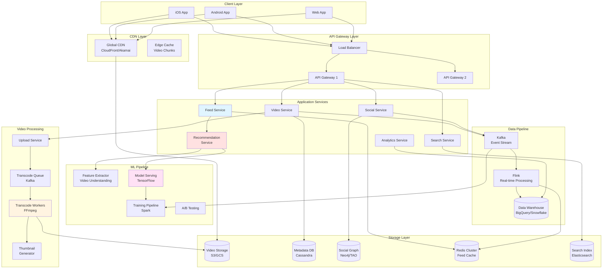

# Design TikTok

## Problem Statement

Design a scalable short-form video sharing platform like TikTok that supports video uploads, personalized recommendations, social features (follow, like, comment), and a highly engaging "For You" feed powered by machine learning. The system should handle millions of concurrent users with low latency video delivery.

**Difficulty:** Hard

**Prerequisites:** Video Streaming, CDN, Recommendation Systems, Machine Learning, Real-time Systems

---

## Step 1: Requirements & Scope

### Functional Requirements

**Core Features:**

1. **Video Management**
   - Upload short videos (15s-3min)
   - Video processing (compression, multiple resolutions)
   - Thumbnail generation
   - Video metadata (title, description, hashtags, music)
   - Delete videos

2. **Feed Types**
   - **For You Feed (FYP):** Personalized recommendations (ML-driven)
   - **Following Feed:** Videos from followed creators
   - **Trending:** Popular videos globally/regionally
   - **Hashtag Feed:** Videos by hashtag
   - **Sound Feed:** Videos using same audio

3. **Social Interactions**
   - Follow/unfollow users
   - Like videos
   - Comment on videos
   - Share videos
   - Duet/Stitch (video remixing)

4. **Discovery**
   - Search videos, users, sounds
   - Trending hashtags and sounds
   - Recommended creators

5. **Creator Tools**
   - Video analytics (views, likes, shares, watch time)
   - Audience demographics
   - Follower growth tracking

### Non-Functional Requirements

1. **Scalability**
   - Support 1 billion+ users
   - 500 million daily active users
   - 100 million videos uploaded daily
   - 10 billion video views per day

2. **Performance**
   - Video playback starts within 200ms
   - Feed loads within 500ms
   - Smooth infinite scroll
   - Preload next 2-3 videos

3. **Availability**
   - 99.99% uptime
   - No single point of failure
   - Global CDN distribution

4. **Engagement**
   - Highly personalized recommendations
   - Maximize watch time
   - Real-time feed updates
   - Low-friction video creation

### Capacity Estimation

**Users:**

```
Total users: 1 billion
Daily active users (DAU): 500 million
Peak concurrent users: 50 million
Average session duration: 52 minutes
```

**Videos:**

```
Videos uploaded per day: 100 million
Average video size: 10 MB (720p, 30s)
Average video duration: 30 seconds
Total video storage: 100M × 10 MB = 1 PB/day
```

**QPS:**

```
Video views per day: 10 billion
Video upload QPS: 100M / 86400 = 1,200 QPS
Video view QPS: 10B / 86400 = 115,000 QPS
Peak QPS (3x average): 350,000 QPS

Feed requests: 500M DAU × 20 feed loads/day = 10B requests/day = 115,000 QPS
Like/comment: 10B interactions/day = 115,000 QPS
```

**Storage:**

```
Video storage:
- Daily: 1 PB (100M videos × 10 MB)
- Monthly: 30 PB
- Yearly: 365 PB
- With encoding (3 resolutions): 3 × 365 PB = 1,095 PB ≈ 1 EB/year

Metadata storage:
- Video metadata: 100M videos/day × 10 KB = 1 TB/day
- User data: 1B users × 5 KB = 5 TB
- Social graph: 1B users × 100 connections × 16 bytes = 1.6 TB
- Comments: 1B comments/day × 500 bytes = 500 GB/day
```

**Bandwidth:**

```
Video upload:
- 1,200 QPS × 10 MB = 12 GB/s = 96 Gbps

Video download (viewing):
- 350K QPS × 10 MB = 3.5 TB/s = 28 Tbps
- With CDN caching (95% hit rate): 1.4 Tbps
```

---

## Step 2: High-Level Design

### System Architecture



### Core Components

=== "Video Upload & Processing"

    **Upload Flow:**

    ```
    1. Client requests upload URL (pre-signed S3 URL)
    2. Client uploads video directly to S3
    3. S3 triggers upload completion event
    4. Video Service creates metadata entry
    5. Transcode job added to queue
    6. Workers transcode to multiple resolutions
    7. Thumbnails generated
    8. ML pipeline extracts features
    9. Video becomes available in feed
    ```

    **Video Processing Pipeline:**

    ```python
    class VideoUploadService:
        def __init__(self, s3_client, kafka_producer, metadata_db):
            self.s3 = s3_client
            self.kafka = kafka_producer
            self.db = metadata_db

        def initiate_upload(self, user_id: int, video_metadata: dict) -> dict:
            """
            Generate pre-signed URL for direct S3 upload

            Benefits:
            - Client uploads directly to S3 (bypass API servers)
            - Reduce server load
            - Faster upload
            """
            video_id = self._generate_video_id()

            # Generate S3 key
            s3_key = f"uploads/{user_id}/{video_id}/original.mp4"

            # Create pre-signed URL (valid for 1 hour)
            upload_url = self.s3.generate_presigned_url(
                'put_object',
                Params={
                    'Bucket': 'tiktok-videos-raw',
                    'Key': s3_key,
                    'ContentType': 'video/mp4'
                },
                ExpiresIn=3600
            )

            # Save initial metadata
            self.db.insert('videos', {
                'video_id': video_id,
                'user_id': user_id,
                'status': 'uploading',
                's3_key': s3_key,
                'title': video_metadata.get('title'),
                'description': video_metadata.get('description'),
                'hashtags': video_metadata.get('hashtags', []),
                'created_at': time.time()
            })

            return {
                'video_id': video_id,
                'upload_url': upload_url,
                's3_key': s3_key
            }

        def on_upload_complete(self, video_id: str, s3_key: str):
            """
            Triggered by S3 event when upload completes

            Flow:
            1. Update video status
            2. Queue transcoding job
            3. Queue thumbnail generation
            4. Queue ML feature extraction
            """
            # Update status
            self.db.update('videos', {
                'video_id': video_id,
                'status': 'processing',
                'uploaded_at': time.time()
            })

            # Emit transcode event
            self.kafka.send('video-transcode', {
                'video_id': video_id,
                's3_key': s3_key,
                'resolutions': ['360p', '720p', '1080p'],
                'priority': self._get_priority(video_id)
            })

            # Emit thumbnail generation event
            self.kafka.send('thumbnail-generate', {
                'video_id': video_id,
                's3_key': s3_key
            })

            # Emit ML feature extraction event
            self.kafka.send('ml-extract-features', {
                'video_id': video_id,
                's3_key': s3_key
            })

        def _get_priority(self, video_id: str) -> str:
            """
            Prioritize videos from popular creators
            """
            video = self.db.get('videos', video_id)
            user = self.db.get('users', video['user_id'])

            if user['followers_count'] > 1_000_000:
                return 'high'  # Process within 1 minute
            elif user['followers_count'] > 10_000:
                return 'medium'  # Process within 5 minutes
            else:
                return 'normal'  # Process within 15 minutes

    class VideoTranscodeWorker:
        def process(self, message: dict):
            """
            Transcode video to multiple resolutions using FFmpeg

            Resolutions:
            - 360p (640x360): Low quality, mobile data saver
            - 720p (1280x720): Standard quality
            - 1080p (1920x1080): High quality
            """
            video_id = message['video_id']
            s3_key = message['s3_key']
            resolutions = message['resolutions']

            # Download original video
            local_path = self._download_from_s3(s3_key)

            # Transcode to each resolution
            output_files = {}
            for resolution in resolutions:
                output_path = self._transcode_video(local_path, resolution)

                # Upload to S3
                output_s3_key = f"videos/{video_id}/{resolution}.mp4"
                self._upload_to_s3(output_path, output_s3_key)

                output_files[resolution] = output_s3_key

            # Update metadata
            self.db.update('videos', {
                'video_id': video_id,
                'status': 'ready',
                'video_urls': output_files,
                'processed_at': time.time()
            })

            # Emit video-ready event
            self.kafka.send('video-ready', {
                'video_id': video_id,
                'user_id': message['user_id']
            })

        def _transcode_video(self, input_path: str, resolution: str) -> str:
            """Transcode using FFmpeg"""
            output_path = f"/tmp/{video_id}_{resolution}.mp4"

            # FFmpeg command for efficient transcoding
            cmd = [
                'ffmpeg',
                '-i', input_path,
                '-vf', f'scale=-2:{self._get_height(resolution)}',  # Maintain aspect ratio
                '-c:v', 'libx264',  # H.264 codec
                '-preset', 'medium',  # Balance speed/quality
                '-crf', '23',  # Quality (lower = better)
                '-c:a', 'aac',  # Audio codec
                '-b:a', '128k',  # Audio bitrate
                '-movflags', '+faststart',  # Enable streaming
                output_path
            ]

            subprocess.run(cmd, check=True)
            return output_path

        def _get_height(self, resolution: str) -> int:
            """Get height for resolution"""
            heights = {
                '360p': 360,
                '720p': 720,
                '1080p': 1080
            }
            return heights[resolution]
    ```

=== "For You Feed (FYP)"

    **Recommendation Algorithm:**

    The "For You" feed is the core of TikTok's engagement. It uses a multi-stage ranking system:

    **Stage 1: Candidate Generation (Recall)**

    ```python
    class CandidateGenerator:
        """
        Generate candidate videos for user's feed

        Strategies:
        1. Collaborative Filtering (users with similar behavior)
        2. Content-based Filtering (videos similar to liked/watched)
        3. Trending videos (global/regional)
        4. Following feed (creators user follows)
        5. Hashtag-based (trending hashtags)
        """

        def generate_candidates(self, user_id: int, limit: int = 1000) -> list:
            """Generate ~1000 candidate videos"""

            candidates = []

            # 1. Collaborative Filtering (30% weight)
            similar_users = self._get_similar_users(user_id, top_k=100)
            cf_videos = self._get_videos_from_users(similar_users, limit=300)
            candidates.extend(cf_videos)

            # 2. Content-based (25% weight)
            user_preferences = self._get_user_preferences(user_id)
            cb_videos = self._find_similar_videos(user_preferences, limit=250)
            candidates.extend(cb_videos)

            # 3. Trending (20% weight)
            trending_videos = self._get_trending_videos(
                user_region=self._get_user_region(user_id),
                limit=200
            )
            candidates.extend(trending_videos)

            # 4. Following (15% weight)
            following_videos = self._get_following_feed(user_id, limit=150)
            candidates.extend(following_videos)

            # 5. Exploration (10% weight) - Random popular videos
            exploration_videos = self._get_random_popular_videos(limit=100)
            candidates.extend(exploration_videos)

            # Deduplicate
            candidates = self._deduplicate(candidates)

            return candidates[:1000]

        def _get_similar_users(self, user_id: int, top_k: int) -> list:
            """
            Find users with similar behavior using collaborative filtering

            Method: User-User similarity based on:
            - Liked videos (Jaccard similarity)
            - Watched videos
            - Followed creators
            """
            # Get user's interaction history
            user_likes = self._get_user_likes(user_id, recent=1000)
            user_watches = self._get_user_watches(user_id, recent=1000)

            # Find users who liked/watched similar videos
            # Use Redis Sorted Sets for fast intersection
            similar_users = []

            # Jaccard similarity: |A ∩ B| / |A ∪ B|
            for candidate_user in self._get_candidate_users(user_id):
                candidate_likes = self._get_user_likes(candidate_user, recent=1000)

                intersection = len(set(user_likes) & set(candidate_likes))
                union = len(set(user_likes) | set(candidate_likes))

                similarity = intersection / union if union > 0 else 0

                if similarity > 0.1:  # Threshold
                    similar_users.append((candidate_user, similarity))

            # Sort by similarity
            similar_users.sort(key=lambda x: x[1], reverse=True)

            return [user for user, _ in similar_users[:top_k]]

        def _get_videos_from_users(self, user_ids: list, limit: int) -> list:
            """Get recent videos from similar users"""
            videos = []

            for user_id in user_ids:
                # Get videos liked/watched by this user
                user_likes = self._get_user_likes(user_id, recent=50)
                videos.extend(user_likes)

                if len(videos) >= limit:
                    break

            return videos[:limit]

        def _find_similar_videos(self, user_preferences: dict, limit: int) -> list:
            """
            Find videos similar to user's preferences

            Preferences include:
            - Favorite hashtags
            - Favorite music/sounds
            - Favorite content categories (comedy, dance, cooking)
            - Video style (length, editing style)
            """
            similar_videos = []

            # Search by hashtags
            for hashtag in user_preferences['hashtags'][:10]:
                videos = self._search_by_hashtag(hashtag, limit=50)
                similar_videos.extend(videos)

            # Search by sounds
            for sound_id in user_preferences['sounds'][:10]:
                videos = self._search_by_sound(sound_id, limit=50)
                similar_videos.extend(videos)

            # Search by categories
            for category in user_preferences['categories'][:5]:
                videos = self._search_by_category(category, limit=50)
                similar_videos.extend(videos)

            return similar_videos[:limit]
    ```

    **Stage 2: Ranking (Scoring)**

    ```python
    class VideoRanker:
        """
        Rank candidate videos using ML model

        Model: LightGBM Gradient Boosting (or Neural Network)
        Objective: Predict engagement score (watch time, like, share)
        """

        def __init__(self, model_service):
            self.model = model_service

        def rank_videos(self, user_id: int, candidate_videos: list) -> list:
            """
            Rank videos by predicted engagement

            Features:
            - User features (age, region, interests, watch history)
            - Video features (hashtags, music, duration, creator popularity)
            - Context features (time of day, day of week, device)
            - Interaction features (user-video match)
            """
            ranked_videos = []

            for video in candidate_videos:
                # Extract features
                features = self._extract_features(user_id, video)

                # Predict engagement score
                score = self.model.predict(features)

                ranked_videos.append({
                    'video_id': video['video_id'],
                    'score': score,
                    'metadata': video
                })

            # Sort by score (descending)
            ranked_videos.sort(key=lambda x: x['score'], reverse=True)

            return ranked_videos

        def _extract_features(self, user_id: int, video: dict) -> dict:
            """Extract features for ML model"""

            user = self._get_user(user_id)
            video_stats = self._get_video_stats(video['video_id'])
            creator = self._get_creator(video['creator_id'])

            features = {
                # User features
                'user_age': user['age'],
                'user_region': user['region'],
                'user_language': user['language'],
                'user_watch_time_avg': user['avg_watch_time'],
                'user_engagement_rate': user['engagement_rate'],

                # Video features
                'video_duration': video['duration'],
                'video_age_hours': (time.time() - video['created_at']) / 3600,
                'video_views': video_stats['views'],
                'video_likes': video_stats['likes'],
                'video_shares': video_stats['shares'],
                'video_comments': video_stats['comments'],
                'video_completion_rate': video_stats['completion_rate'],

                # Creator features
                'creator_followers': creator['followers_count'],
                'creator_avg_views': creator['avg_views'],
                'creator_posting_frequency': creator['posts_per_week'],

                # Interaction features
                'user_creator_similarity': self._calculate_similarity(user, creator),
                'user_hashtag_match': self._hashtag_match_score(user, video),
                'user_sound_match': self._sound_match_score(user, video),

                # Context features
                'hour_of_day': datetime.now().hour,
                'day_of_week': datetime.now().weekday(),
                'is_weekend': datetime.now().weekday() >= 5,
            }

            return features
    ```

    **Stage 3: Feed Mixing & Diversity**

    ```python
    class FeedMixer:
        """
        Mix ranked videos with diversity constraints

        Goals:
        - Avoid showing same creator twice in a row
        - Mix different content types (comedy, dance, cooking)
        - Insert trending videos periodically
        - Balance popular vs new creators
        """

        def mix_feed(self, ranked_videos: list, user_id: int) -> list:
            """Apply diversity rules to ranked videos"""

            final_feed = []
            seen_creators = set()
            seen_sounds = set()
            content_type_counts = defaultdict(int)

            for i, video in enumerate(ranked_videos):
                # Check diversity constraints
                if self._should_include(video, seen_creators, seen_sounds, content_type_counts):
                    final_feed.append(video)
                    seen_creators.add(video['creator_id'])
                    seen_sounds.add(video['sound_id'])
                    content_type_counts[video['category']] += 1

                    # Reset tracking every 10 videos (allow repeats after gap)
                    if len(final_feed) % 10 == 0:
                        seen_creators.clear()
                        seen_sounds.clear()

                # Insert trending video every 20 videos
                if len(final_feed) % 20 == 19:
                    trending_video = self._get_trending_video(user_id)
                    if trending_video:
                        final_feed.append(trending_video)

                # Target feed size: 50 videos (client will request more as user scrolls)
                if len(final_feed) >= 50:
                    break

            return final_feed

        def _should_include(self, video, seen_creators, seen_sounds, content_type_counts):
            """Check if video should be included (diversity rules)"""

            # Rule 1: Don't show same creator consecutively
            if video['creator_id'] in seen_creators:
                return False

            # Rule 2: Don't show same sound too frequently
            if video['sound_id'] in seen_sounds:
                return False

            # Rule 3: Limit same content type (max 3 in a row)
            if content_type_counts[video['category']] >= 3:
                return False

            return True
    ```

    **Caching Strategy:**

    ```python
    class FeedCache:
        """
        Cache personalized feeds in Redis

        Cache Structure:
        - Key: "feed:{user_id}"
        - Value: List of video IDs
        - TTL: 5 minutes

        Benefits:
        - Reduce ML inference cost
        - Faster feed loading
        - Pre-generate feeds for active users
        """

        def get_feed(self, user_id: int, offset: int = 0, limit: int = 50) -> list:
            """Get feed from cache or generate"""

            cache_key = f"feed:{user_id}"

            # Try cache first
            cached_feed = self.redis.lrange(cache_key, offset, offset + limit - 1)

            if cached_feed:
                # Cache hit
                video_ids = [vid.decode() for vid in cached_feed]
                return self._hydrate_videos(video_ids)

            # Cache miss - generate feed
            feed = self._generate_feed(user_id)

            # Cache for 5 minutes
            pipeline = self.redis.pipeline()
            pipeline.delete(cache_key)
            pipeline.rpush(cache_key, *[v['video_id'] for v in feed])
            pipeline.expire(cache_key, 300)
            pipeline.execute()

            return feed[offset:offset + limit]
    ```

=== "Video Delivery & CDN"

    **Adaptive Bitrate Streaming:**

    ```python
    class VideoDeliveryService:
        """
        Serve videos with adaptive bitrate streaming

        Protocol: HLS (HTTP Live Streaming)
        - Video split into chunks (2-10 seconds each)
        - Multiple quality levels
        - Client adaptively switches based on bandwidth

        Benefits:
        - Fast startup (start with low quality)
        - Smooth playback (adapt to network conditions)
        - Better user experience
        """

        def get_video_manifest(self, video_id: str, user_region: str) -> dict:
            """
            Generate HLS manifest (m3u8 playlist)

            Returns CDN URLs for video chunks at different qualities
            """
            video = self.db.get('videos', video_id)

            # Get CDN base URL for user's region
            cdn_base = self._get_cdn_url(user_region)

            # Generate manifest
            manifest = {
                'video_id': video_id,
                'type': 'hls',
                'variants': [
                    {
                        'resolution': '360p',
                        'bandwidth': 800_000,  # 800 Kbps
                        'url': f"{cdn_base}/videos/{video_id}/360p/playlist.m3u8"
                    },
                    {
                        'resolution': '720p',
                        'bandwidth': 2_500_000,  # 2.5 Mbps
                        'url': f"{cdn_base}/videos/{video_id}/720p/playlist.m3u8"
                    },
                    {
                        'resolution': '1080p',
                        'bandwidth': 5_000_000,  # 5 Mbps
                        'url': f"{cdn_base}/videos/{video_id}/1080p/playlist.m3u8"
                    }
                ]
            }

            return manifest

        def _get_cdn_url(self, region: str) -> str:
            """Get nearest CDN edge for user's region"""
            cdn_edges = {
                'us-east': 'https://video-us-east.tiktok.com',
                'us-west': 'https://video-us-west.tiktok.com',
                'eu-west': 'https://video-eu-west.tiktok.com',
                'ap-southeast': 'https://video-ap-southeast.tiktok.com',
            }
            return cdn_edges.get(region, cdn_edges['us-east'])

    class VideoPreloader:
        """
        Preload next videos while user watches current video

        Strategy:
        - Preload first chunk (2-4 seconds) of next 2-3 videos
        - Start with low quality (360p)
        - Upgrade to higher quality if bandwidth available

        Benefits:
        - Instant playback when user swipes
        - Seamless infinite scroll experience
        """

        def preload_next_videos(self, current_video_id: str, next_videos: list):
            """Preload chunks for next videos"""

            for i, video in enumerate(next_videos[:3]):
                if i == 0:
                    # Preload first 4 seconds of immediate next video
                    self._preload_chunks(video['video_id'], resolution='720p', chunks=2)
                else:
                    # Preload first 2 seconds of subsequent videos
                    self._preload_chunks(video['video_id'], resolution='360p', chunks=1)

        def _preload_chunks(self, video_id: str, resolution: str, chunks: int):
            """Preload specified chunks"""
            manifest_url = f"/videos/{video_id}/{resolution}/playlist.m3u8"

            # Parse manifest to get chunk URLs
            chunk_urls = self._parse_manifest(manifest_url)

            # Fetch first N chunks
            for url in chunk_urls[:chunks]:
                self._fetch_in_background(url)
    ```

    **CDN Strategy:**

    ```
    Multi-Tier CDN Architecture:

    Tier 1: Edge Locations (200+ POPs globally)
    ├── Cache hot videos (95% hit rate)
    ├── Serve from nearest location to user
    └── TTL: 24 hours

    Tier 2: Regional Caches (10-15 regions)
    ├── Cache popular videos per region
    ├── Serve to edge locations on miss
    └── TTL: 7 days

    Tier 3: Origin (S3/GCS)
    ├── Store all videos
    ├── Source of truth
    └── Accessed only on cold start

    Cache Invalidation:
    - Video deleted → Purge from all tiers
    - Video updated → Update manifest only (chunks remain)

    Cost Optimization:
    - Edge cache size: 10 TB per POP (hot videos)
    - Regional cache: 500 TB per region
    - 95% CDN hit rate → Save 95% of bandwidth cost
    ```

=== "Social Graph & Interactions"

    **Social Graph Storage:**

    ```python
    class SocialGraphService:
        """
        Manage social relationships (follow, like, comment)

        Storage: Graph Database (Neo4j) or TAO (Facebook's system)

        Relationships:
        - User FOLLOWS User
        - User LIKES Video
        - User COMMENTS_ON Video
        - User SHARES Video
        """

        def follow_user(self, follower_id: int, followee_id: int):
            """Create follow relationship"""

            # Write to graph DB
            self.graph_db.run("""
                MATCH (follower:User {id: $follower_id})
                MATCH (followee:User {id: $followee_id})
                CREATE (follower)-[:FOLLOWS {created_at: timestamp()}]->(followee)
            """, follower_id=follower_id, followee_id=followee_id)

            # Update follower counts (cached in Redis)
            self.redis.hincrby(f"user:{followee_id}", 'followers_count', 1)
            self.redis.hincrby(f"user:{follower_id}", 'following_count', 1)

            # Fan-out: Add to follower's feed
            # (when followee posts new video, it appears in follower's feed)
            self.redis.sadd(f"user:{follower_id}:following", followee_id)

            # Emit event for analytics
            self.kafka.send('user-followed', {
                'follower_id': follower_id,
                'followee_id': followee_id,
                'timestamp': time.time()
            })

        def like_video(self, user_id: int, video_id: str):
            """Like a video"""

            # Check if already liked (idempotent)
            already_liked = self.redis.sismember(
                f"user:{user_id}:likes",
                video_id
            )

            if already_liked:
                return

            # Add to user's likes (Redis Set)
            self.redis.sadd(f"user:{user_id}:likes", video_id)

            # Increment video like count
            self.redis.hincrby(f"video:{video_id}", 'likes_count', 1)

            # Write to database (eventually consistent)
            self.db.insert('likes', {
                'user_id': user_id,
                'video_id': video_id,
                'created_at': time.time()
            })

            # Emit event for real-time updates + ML training
            self.kafka.send('video-liked', {
                'user_id': user_id,
                'video_id': video_id,
                'timestamp': time.time()
            })

        def get_following_feed(self, user_id: int, limit: int = 50) -> list:
            """
            Get videos from users that this user follows

            Strategy:
            - Pull from Redis cache (pre-aggregated)
            - Fallback to DB query
            """
            cache_key = f"feed:following:{user_id}"

            # Try cache
            cached_videos = self.redis.lrange(cache_key, 0, limit - 1)

            if cached_videos:
                video_ids = [v.decode() for v in cached_videos]
                return self._hydrate_videos(video_ids)

            # Cache miss - query DB
            following_users = self._get_following_list(user_id)

            # Get recent videos from followed users
            videos = self.db.query("""
                SELECT * FROM videos
                WHERE creator_id IN %s
                  AND created_at > %s
                ORDER BY created_at DESC
                LIMIT %s
            """, (following_users, time.time() - 86400 * 7, limit))

            # Cache result
            if videos:
                video_ids = [v['video_id'] for v in videos]
                self.redis.rpush(cache_key, *video_ids)
                self.redis.expire(cache_key, 300)  # 5 min TTL

            return videos
    ```

---

## Step 3: Deep Dive

### 3.1 Recommendation System Architecture

=== "Feature Engineering"

    **Video Features (Content Understanding):**

    ```python
    class VideoFeatureExtractor:
        """
        Extract features from video using ML models

        Models:
        - ResNet50: Scene understanding, object detection
        - AudioSet: Sound classification
        - OCR: Text in video
        - Face detection: Number of people
        """

        def extract_features(self, video_id: str, video_path: str) -> dict:
            """Extract comprehensive features from video"""

            features = {}

            # 1. Visual features
            visual_features = self._extract_visual_features(video_path)
            features.update(visual_features)

            # 2. Audio features
            audio_features = self._extract_audio_features(video_path)
            features.update(audio_features)

            # 3. Text features (OCR + speech-to-text)
            text_features = self._extract_text_features(video_path)
            features.update(text_features)

            # 4. Metadata features
            metadata = self._get_video_metadata(video_id)
            features['hashtags'] = metadata['hashtags']
            features['sound_id'] = metadata['sound_id']
            features['duration'] = metadata['duration']

            # Store features
            self.db.insert('video_features', {
                'video_id': video_id,
                'features': json.dumps(features),
                'extracted_at': time.time()
            })

            return features

        def _extract_visual_features(self, video_path: str) -> dict:
            """Extract visual features using ResNet50"""

            # Sample frames (1 frame per second)
            frames = self._sample_frames(video_path, fps=1)

            scene_types = []
            objects = []
            colors = []
            faces_count = []

            for frame in frames:
                # Scene classification
                scene = self.scene_model.predict(frame)
                scene_types.append(scene)

                # Object detection
                detected_objects = self.object_model.detect(frame)
                objects.extend(detected_objects)

                # Dominant colors
                dominant_colors = self._extract_colors(frame)
                colors.extend(dominant_colors)

                # Face detection
                num_faces = self.face_detector.count_faces(frame)
                faces_count.append(num_faces)

            return {
                'scene_types': list(set(scene_types)),
                'objects': list(set(objects)),
                'dominant_colors': self._aggregate_colors(colors),
                'avg_faces': np.mean(faces_count),
                'has_faces': np.mean(faces_count) > 0
            }

        def _extract_audio_features(self, video_path: str) -> dict:
            """Extract audio features using AudioSet"""

            # Extract audio track
            audio_path = self._extract_audio(video_path)

            # Classify sounds
            sounds = self.audio_model.classify(audio_path)

            # Speech detection
            has_speech = self._detect_speech(audio_path)

            # Music detection
            has_music = 'music' in sounds

            return {
                'sounds': sounds,
                'has_speech': has_speech,
                'has_music': has_music,
                'sound_types': self._categorize_sounds(sounds)
            }
    ```

=== "Model Training"

    **Training Pipeline:**

    ```python
    class RecommendationModelTraining:
        """
        Train recommendation model using historical data

        Model: Two-tower neural network
        - User tower: Encodes user preferences
        - Video tower: Encodes video content
        - Output: Similarity score (dot product)

        Training Data:
        - Positive: User watched video >50% duration
        - Negative: User scrolled past video <2 seconds
        """

        def train_model(self):
            """Train recommendation model on Spark cluster"""

            # 1. Load training data (last 30 days)
            training_data = self._load_training_data()

            # 2. Feature engineering
            user_features = self._extract_user_features(training_data)
            video_features = self._extract_video_features(training_data)

            # 3. Create training pairs
            positive_pairs = self._create_positive_pairs(training_data)
            negative_pairs = self._create_negative_pairs(training_data)

            # 4. Train model
            model = self._build_model()
            model.fit(
                x=[user_features, video_features],
                y=labels,
                epochs=10,
                batch_size=1024,
                validation_split=0.2
            )

            # 5. Evaluate model
            metrics = self._evaluate_model(model)
            logger.info(f"Model metrics: {metrics}")

            # 6. Deploy model
            self._deploy_model(model)

        def _create_positive_pairs(self, data) -> list:
            """
            Create positive training examples

            Criteria:
            - Watch time >50% of video duration
            - User liked/shared video
            - User followed creator after watching
            """
            positive_pairs = []

            for row in data:
                watch_percentage = row['watch_time'] / row['video_duration']

                if watch_percentage > 0.5:
                    positive_pairs.append({
                        'user_id': row['user_id'],
                        'video_id': row['video_id'],
                        'label': 1,
                        'weight': watch_percentage  # Higher weight for complete views
                    })

            return positive_pairs

        def _create_negative_pairs(self, data) -> list:
            """
            Create negative training examples

            Criteria:
            - Watch time <2 seconds (scrolled past)
            - Random videos NOT shown to user (hard negatives)
            """
            negative_pairs = []

            for row in data:
                watch_percentage = row['watch_time'] / row['video_duration']

                if watch_percentage < 0.05:  # <5% watched
                    negative_pairs.append({
                        'user_id': row['user_id'],
                        'video_id': row['video_id'],
                        'label': 0,
                        'weight': 1.0
                    })

            return negative_pairs
    ```

=== "Real-time Personalization"

    **Online Learning:**

    ```python
    class OnlinePersonalization:
        """
        Update user preferences in real-time based on interactions

        Strategy:
        - Track user interactions (views, likes, shares)
        - Update user profile immediately
        - Refresh feed recommendations
        - A/B test new models
        """

        def on_video_watched(self, user_id: int, video_id: str, watch_time: float):
            """Update user profile when video watched"""

            video = self.db.get('videos', video_id)
            video_features = self._get_video_features(video_id)

            # Update user profile
            user_profile = self._get_user_profile(user_id)

            # Update hashtag preferences (exponential moving average)
            for hashtag in video['hashtags']:
                current_score = user_profile['hashtags'].get(hashtag, 0)
                new_score = 0.9 * current_score + 0.1 * watch_time
                user_profile['hashtags'][hashtag] = new_score

            # Update sound preferences
            if video['sound_id']:
                current_score = user_profile['sounds'].get(video['sound_id'], 0)
                new_score = 0.9 * current_score + 0.1 * watch_time
                user_profile['sounds'][video['sound_id']] = new_score

            # Update category preferences
            current_score = user_profile['categories'].get(video['category'], 0)
            new_score = 0.9 * current_score + 0.1 * watch_time
            user_profile['categories'][video['category']] = new_score

            # Save updated profile
            self._save_user_profile(user_id, user_profile)

            # Invalidate feed cache (force regeneration with new preferences)
            self.redis.delete(f"feed:{user_id}")
    ```

### 3.2 Video Processing at Scale

=== "Distributed Transcoding"

    **Challenge:** Transcode 100M videos/day

    ```python
    class DistributedTranscodeSystem:
        """
        Distributed video transcoding system

        Architecture:
        - Job queue (Kafka)
        - Worker pool (1000+ EC2 instances)
        - Priority-based scheduling
        - Auto-scaling based on queue depth

        Throughput:
        - 1000 workers × 2 videos/min = 2000 videos/min = 2.88M videos/day
        - Need 35 workers to handle 100M videos/day (with priority queuing)
        """

        def scale_workers(self):
            """Auto-scale workers based on queue depth"""

            queue_depth = self.kafka.get_lag('video-transcode')

            current_workers = self._get_active_workers()

            if queue_depth > 100000:  # 100K videos in queue
                # Scale up
                target_workers = min(1000, current_workers * 2)
                self._launch_workers(target_workers - current_workers)

            elif queue_depth < 10000 and current_workers > 100:
                # Scale down
                target_workers = max(100, current_workers // 2)
                self._terminate_workers(current_workers - target_workers)

        def _launch_workers(self, count: int):
            """Launch spot instances for transcoding"""

            # Use spot instances (70% cost savings)
            response = ec2.run_instances(
                ImageId='ami-transcode-worker',
                InstanceType='c5.2xlarge',  # 8 vCPU, optimized for compute
                MinCount=count,
                MaxCount=count,
                InstanceMarketOptions={
                    'MarketType': 'spot',
                    'SpotOptions': {
                        'MaxPrice': '0.10',  # $0.10/hour (70% discount)
                        'SpotInstanceType': 'one-time'
                    }
                },
                UserData=self._get_worker_startup_script()
            )
    ```

### 3.3 Analytics & Metrics

=== "Real-time Analytics"

    ```python
    class VideoAnalytics:
        """
        Track video performance metrics in real-time

        Metrics:
        - Views, likes, shares, comments
        - Watch time, completion rate
        - Geographic distribution
        - Traffic sources
        """

        def track_view(self, video_id: str, user_id: int, metadata: dict):
            """Track video view"""

            # Increment counters (Redis)
            self.redis.hincrby(f"video:{video_id}:stats", 'views', 1)

            # Track hourly views (time series)
            hour_key = f"video:{video_id}:views:hourly:{datetime.now().strftime('%Y%m%d%H')}"
            self.redis.incr(hour_key)
            self.redis.expire(hour_key, 86400 * 7)  # Keep 7 days

            # Geographic distribution
            region = metadata['region']
            self.redis.hincrby(f"video:{video_id}:regions", region, 1)

            # Stream to analytics DB (ClickHouse)
            self.analytics_db.insert('video_views', {
                'video_id': video_id,
                'user_id': user_id,
                'timestamp': time.time(),
                'region': region,
                'device': metadata['device'],
                'watch_time': metadata['watch_time']
            })

        def get_video_analytics(self, video_id: str) -> dict:
            """Get comprehensive analytics for video"""

            stats = self.redis.hgetall(f"video:{video_id}:stats")

            # Query time-series data
            hourly_views = self._get_hourly_views(video_id, hours=24)

            # Calculate derived metrics
            engagement_rate = (stats['likes'] + stats['shares']) / stats['views']
            completion_rate = stats['completed_views'] / stats['views']

            return {
                'views': int(stats['views']),
                'likes': int(stats['likes']),
                'shares': int(stats['shares']),
                'comments': int(stats['comments']),
                'engagement_rate': engagement_rate,
                'completion_rate': completion_rate,
                'hourly_views': hourly_views,
                'geographic_distribution': self._get_geo_distribution(video_id)
            }
    ```

---

## Step 4: Scale & Optimize

### Performance at Scale

=== "Throughput"

    **Target:** 350K QPS (video views)

    ```
    Architecture:
    - 1000 API servers (c5.2xlarge)
    - Each handles 350 QPS
    - Load balanced across regions

    Video serving:
    - 95% served by CDN (no backend hit)
    - 5% cache miss → origin servers
    - 17.5K QPS to origin

    Optimization:
    - Async processing (Kafka for events)
    - Connection pooling
    - Database read replicas (10x)
    ```

=== "Latency"

    **Targets:**
    - Video playback start: <200ms
    - Feed load: <500ms
    - Interactions (like/comment): <100ms

    ```
    Video Playback Latency Breakdown:
    1. API request (manifest): 50ms
    2. CDN lookup: 20ms
    3. First chunk download: 100ms
    4. Decode + render: 30ms
    Total: 200ms

    Feed Load Latency:
    1. API request: 50ms
    2. Redis cache lookup: 10ms
    3. Response serialization: 20ms
    4. Network transfer: 30ms
    Total: 110ms (cache hit)

    If cache miss:
    + ML model inference: 200ms
    Total: 310ms (still acceptable)
    ```

=== "Cost"

    **Monthly Cost Estimate (500M DAU):**

    ```
    1. Compute:
       - API servers: 1000 × c5.2xlarge = $200K/month
       - Transcode workers: 100 × c5.2xlarge (spot) = $7K/month
       - ML inference: 100 × g4dn.xlarge = $40K/month

    2. Storage:
       - S3 (video storage): 1 EB × $0.023/GB = $23.5M/month
       - S3 Glacier (old videos): 500 PB × $0.004/GB = $2M/month
       - Database (Cassandra): 100 nodes = $100K/month

    3. CDN:
       - Bandwidth: 1 EB/month × $0.08/GB = $80M/month
       - 95% cache hit rate → $4M/month

    4. Networking:
       - Inter-region transfer: $500K/month

    Total: ~$30M/month ≈ $360M/year

    Revenue per user (ads): $10/year
    Revenue: 500M × $10 = $5B/year
    Margin: $5B - $360M = $4.64B (92% margin)
    ```

### Trade-offs

| Aspect | Option A | Option B | Recommendation |
|--------|----------|----------|----------------|
| **Feed Algorithm** | Pure ML (accurate) | Hybrid (ML + rules) | **Hybrid** (balance accuracy + diversity) |
| **Video Storage** | All resolutions always | On-demand transcoding | **Pre-transcode 3 resolutions** (balance cost + latency) |
| **Caching** | No cache (always fresh) | Aggressive cache | **5-min cache** (balance freshness + load) |
| **Recommendation** | Personalized only | Mix personalized + trending | **80/20 split** (personalized + exploration) |
| **CDN Strategy** | Origin-only | Full CDN | **95% CDN hit rate** (balance cost + performance) |

### Interview Tips

**Common Follow-up Questions:**

1. **"How does the For You feed work?"**
   - Multi-stage ranking: Candidate generation (1000 videos) → Ranking (ML model) → Mixing (diversity)
   - Collaborative filtering + content-based filtering + trending
   - Real-time personalization based on interactions
   - A/B testing for model improvements

2. **"How do you handle video uploads at scale?"**
   - Direct upload to S3 (pre-signed URLs)
   - Async transcoding (Kafka + worker pool)
   - Priority-based processing (popular creators first)
   - Auto-scaling workers based on queue depth

3. **"How do you ensure low latency video playback?"**
   - Global CDN (95% hit rate)
   - Adaptive bitrate streaming (HLS)
   - Preload next videos (first chunk)
   - Edge locations near users

4. **"How do you prevent content duplication?"**
   - Perceptual hashing (find similar videos)
   - Audio fingerprinting
   - Check before allowing upload
   - Remove duplicates in feed

5. **"How do you handle trending videos?"**
   - Real-time trend detection (Flink streaming)
   - Score = (views + likes + shares) / age
   - Regional trending (per country)
   - Insert trending videos in feed periodically

---

## Summary

**System Characteristics:**
- **Scale:** 500M DAU, 100M videos/day, 10B views/day
- **Performance:** <200ms video start, <500ms feed load
- **Availability:** 99.99% uptime, global CDN
- **Cost:** ~$360M/year infrastructure

**Core Components:**
1. **Video Processing:** Direct S3 upload, distributed transcoding, multi-resolution
2. **Recommendation:** ML-based ranking, collaborative filtering, real-time personalization
3. **CDN:** Multi-tier caching, adaptive bitrate, preloading
4. **Social Graph:** Follow/like/comment, real-time updates
5. **Analytics:** Real-time metrics, creator dashboard

**Key Design Decisions:**
- Direct S3 upload (reduce server load)
- HLS adaptive streaming (smooth playback)
- Multi-stage recommendation (accuracy + diversity)
- Aggressive CDN caching (95% hit rate)
- Kafka for async processing (scalability)
- Redis for caching (low latency)

This design delivers an engaging, personalized video platform at massive scale.
