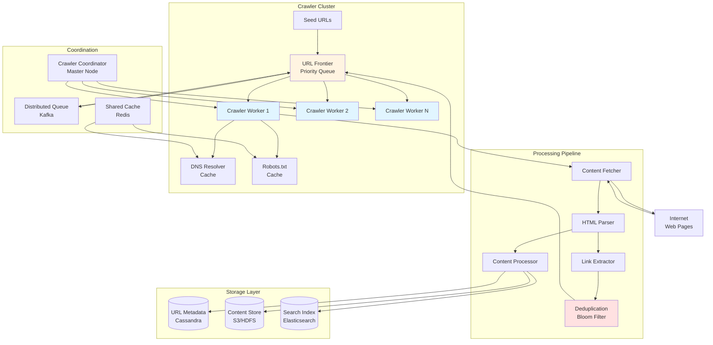
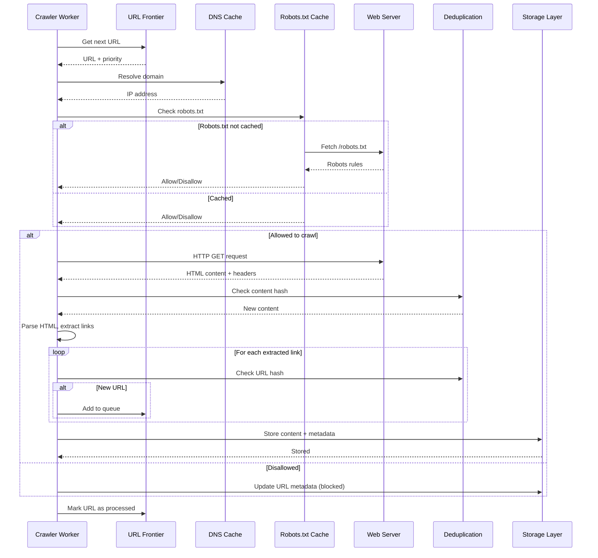

# Design Web Crawler

## Problem Statement

Design a scalable web crawler that can discover, download, and index billions of web pages across the internet. The crawler should be efficient, respectful of robots.txt rules, and capable of handling various content types while avoiding duplicate content and infinite loops.

**Difficulty:** Hard

**Prerequisites:** Distributed Systems, Queuing, Graph Traversal, Content Parsing

---

## Step 1: Requirements & Scope

### Functional Requirements

**Core Features:**

1. **URL Discovery & Crawling**
   - Discover new URLs from seed URLs
   - Follow links from crawled pages
   - Support multiple protocols (HTTP, HTTPS)
   - Handle redirects (301, 302, 307, 308)

2. **Content Processing**
   - Download and parse HTML content
   - Extract links from pages
   - Extract metadata (title, description, keywords)
   - Handle different content types (HTML, PDF, images)

3. **Politeness & Compliance**
   - Respect robots.txt rules
   - Implement rate limiting per domain
   - Honor crawl-delay directives
   - Support nofollow and noindex meta tags

4. **Storage & Indexing**
   - Store downloaded content
   - Index content for search
   - Maintain URL metadata (last crawl time, status)
   - Track crawl history

### Non-Functional Requirements

1. **Scalability**
   - Crawl billions of web pages
   - Handle 1,000+ pages per second
   - Distribute crawling across multiple machines

2. **Reliability**
   - Handle network failures gracefully
   - Retry failed requests with exponential backoff
   - Detect and recover from crawler traps
   - Resume crawling after failures

3. **Efficiency**
   - Minimize bandwidth usage
   - Prioritize important pages (PageRank-based)
   - Avoid re-crawling unchanged content (ETags, Last-Modified)
   - Deduplicate content efficiently

4. **Freshness**
   - Re-crawl pages based on change frequency
   - Prioritize news and frequently updated sites
   - Adaptive crawl scheduling

### Capacity Estimation

**Assumptions:**

- Total web pages to crawl: 10 billion
- Average page size: 100 KB (HTML + resources)
- Crawl frequency: Monthly re-crawl
- Crawl rate: 1,000 pages/second

**Storage:**

```
Total Storage = 10B pages × 100 KB = 1 PB
Monthly growth = 100M new pages × 100 KB = 10 TB/month
With 3 copies (raw, processed, backup) = 3 PB
```

**Bandwidth:**

```
Download bandwidth = 1,000 pages/sec × 100 KB = 100 MB/s = 800 Mbps
Upload bandwidth (to storage) = 800 Mbps
Total bandwidth = 1.6 Gbps
```

**QPS:**

```
DNS lookups = 1,000 pages/sec ÷ 10 (avg pages per domain) = 100 QPS
URL frontier queries = 1,000 QPS (selecting next URLs)
robots.txt checks = 100 QPS (per new domain)
```

**Memory:**

```
URL frontier (queue): 100M URLs × 200 bytes = 20 GB
Bloom filter (deduplication): 10B URLs × 10 bits = 12.5 GB
DNS cache: 100K domains × 1 KB = 100 MB
robots.txt cache: 100K domains × 10 KB = 1 GB
Total per crawler node ≈ 40 GB
```

---

## Step 2: High-Level Design

### System Architecture



### Core Components

=== "URL Frontier"

    **Purpose:** Manage the queue of URLs to be crawled with prioritization

    **Why We Need It:**

    - Priority-based crawling (important pages first)
    - Politeness: Rate limiting per domain
    - Freshness: Re-crawl based on change frequency
    - Load distribution across crawler workers

    **Design:**

    ```
    URL Frontier = Priority Queues + Politeness Queue + Back Queue

    1. Priority Queues (based on importance)
       - Queue 1: High priority (news sites, frequently updated)
       - Queue 2: Medium priority (popular domains)
       - Queue 3: Low priority (rarely updated pages)

    2. Politeness Queue (per-domain queues)
       - One queue per domain
       - Rate limit: 1 request per second per domain
       - Respect crawl-delay from robots.txt

    3. Back Queue (for retries)
       - Failed URLs with exponential backoff
       - Temporary failures (5xx errors)
    ```

    **Implementation:**

    - Use Redis Sorted Sets for priority queues
    - Score = priority_score + freshness_score - age
    - Separate queue per domain for politeness
    - Background thread to move URLs from priority queue to domain queues

=== "Crawler Worker"

    **Purpose:** Fetch web pages, parse content, and extract links

    **Responsibilities:**

    1. **Fetch URLs** from URL Frontier
    2. **DNS resolution** with caching
    3. **Check robots.txt** compliance
    4. **Download content** via HTTP/HTTPS
    5. **Parse HTML** and extract links
    6. **Process content** for indexing
    7. **Deduplicate** URLs and content
    8. **Update URL metadata**

    **Worker Architecture:**

    ```
    Crawler Worker:
    ├── URL Selector (picks next URL from frontier)
    ├── DNS Resolver (cached)
    ├── Robots.txt Checker (cached)
    ├── HTTP Fetcher (with retry logic)
    ├── Content Parser (HTML, PDF, etc.)
    ├── Link Extractor (finds new URLs)
    ├── Content Processor (extract text, metadata)
    └── Storage Writer (persist data)
    ```

    **Politeness Implementation:**

    - Track last fetch time per domain
    - Wait for crawl-delay before next request
    - Limit concurrent connections per domain
    - Use exponential backoff for failures

=== "Deduplication"

    **Purpose:** Avoid crawling duplicate URLs and content

    **Why We Need It:**

    - Same content accessible via different URLs
    - URL parameters creating infinite variations
    - Redirects leading to same page
    - Save bandwidth and storage

    **Multi-Level Deduplication:**

    ```
    Level 1: URL Deduplication (before crawling)
    ├── Normalize URLs (remove fragments, sort params)
    ├── Bloom Filter (10B URLs, 1% false positive)
    └── URL fingerprint (MD5 hash)

    Level 2: Content Deduplication (after crawling)
    ├── Content fingerprint (Simhash for near-duplicate)
    ├── Check against existing fingerprints
    └── Skip storage if duplicate found

    Level 3: Structural Deduplication
    ├── DOM tree similarity
    └── Template detection (boilerplate removal)
    ```

    **Storage:**

    - Bloom Filter: 12.5 GB in memory (10B URLs)
    - URL fingerprints: Cassandra (permanent storage)
    - Content fingerprints: Redis cache + Cassandra

=== "Storage Layer"

    **Purpose:** Store crawled content, metadata, and index for search

    **Storage Components:**

    **1. URL Metadata Store (Cassandra)**

    ```sql
    CREATE TABLE url_metadata (
        url_hash text PRIMARY KEY,
        url text,
        domain text,
        status_code int,
        last_crawled timestamp,
        next_crawl timestamp,
        crawl_count int,
        content_hash text,
        page_rank double,
        change_frequency text
    );

    CREATE INDEX ON url_metadata (domain);
    CREATE INDEX ON url_metadata (next_crawl);
    ```

    **2. Content Store (S3/HDFS)**

    ```
    Storage Structure:
    /crawl-data/
      ├── year=2026/
      │   ├── month=01/
      │   │   ├── day=30/
      │   │   │   ├── domain=example.com/
      │   │   │   │   ├── page1.html.gz
      │   │   │   │   ├── page2.html.gz
    ```

    - Compressed storage (gzip): 5:1 compression ratio
    - Partitioned by date and domain
    - Lifecycle policy: archive after 1 year

    **3. Search Index (Elasticsearch)**

    ```json
    {
      "url": "https://example.com/page",
      "title": "Page Title",
      "content": "Extracted text content...",
      "meta_description": "Page description",
      "keywords": ["keyword1", "keyword2"],
      "crawl_date": "2026-01-30T12:00:00Z",
      "language": "en",
      "page_rank": 0.85
    }
    ```

### Crawl Flow Sequence



### Data Flow

**Input Flow:**

```
Seed URLs → URL Frontier → Crawler Workers
```

**Processing Flow:**

```
1. Fetch URL from frontier
2. DNS resolution (cached)
3. Check robots.txt (cached)
4. Download content
5. Parse HTML
6. Extract links (new URLs to frontier)
7. Extract content (text, metadata)
8. Deduplicate (URL + content)
9. Store content
10. Index for search
11. Update URL metadata
```

**Output Flow:**

```
Content → S3/HDFS (raw storage)
Content → Elasticsearch (search index)
Metadata → Cassandra (URL metadata)
New URLs → URL Frontier (for future crawls)
```

---

## Step 3: Deep Dive

### 3.1 URL Frontier & Prioritization

=== "Priority Queue Design"

    **Multi-Level Priority System:**

    **Priority Score Calculation:**

    ```python
    def calculate_priority_score(url_metadata):
        """
        Calculate priority score for URL
        Higher score = higher priority
        """
        # Base score from PageRank (0-1)
        pagerank_score = url_metadata.page_rank * 1000

        # Freshness score (time since last crawl)
        hours_since_crawl = (now - url_metadata.last_crawled).hours
        freshness_score = min(hours_since_crawl / 24, 30)  # Cap at 30 days

        # Change frequency score
        change_freq_scores = {
            'always': 100,
            'hourly': 50,
            'daily': 20,
            'weekly': 10,
            'monthly': 5,
            'yearly': 1,
            'never': 0
        }
        change_score = change_freq_scores.get(url_metadata.change_frequency, 10)

        # Domain authority (based on historical data)
        domain_score = get_domain_authority(url_metadata.domain) * 50

        # Content type bonus
        content_bonus = 0
        if is_news_site(url_metadata.domain):
            content_bonus = 200
        elif is_social_media(url_metadata.domain):
            content_bonus = 150

        # Final score
        total_score = (
            pagerank_score * 0.4 +
            freshness_score * 0.2 +
            change_score * 0.15 +
            domain_score * 0.15 +
            content_bonus * 0.1
        )

        return total_score
    ```

    **Priority Queue Implementation:**

    ```python
    import redis
    from typing import Optional

    class URLFrontier:
        def __init__(self, redis_client: redis.Redis):
            self.redis = redis_client
            self.priority_queue_key = "url_frontier:priority"
            self.domain_queues_prefix = "url_frontier:domain:"

        def add_url(self, url: str, priority: float, domain: str):
            """Add URL to frontier with priority"""
            # Add to priority queue
            self.redis.zadd(
                self.priority_queue_key,
                {url: priority}
            )

            # Add to domain-specific queue for politeness
            domain_queue_key = f"{self.domain_queues_prefix}{domain}"
            self.redis.rpush(domain_queue_key, url)

        def get_next_url(self, worker_id: str) -> Optional[dict]:
            """
            Get next URL to crawl
            Implements politeness: respects per-domain rate limits
            """
            # Try to get URL from priority queue
            urls = self.redis.zrevrange(
                self.priority_queue_key,
                0, 100,  # Top 100 URLs
                withscores=True
            )

            if not urls:
                return None

            # Find URL whose domain is ready to be crawled
            for url, priority in urls:
                url = url.decode('utf-8')
                domain = extract_domain(url)

                # Check if domain is ready (politeness check)
                if self._is_domain_ready(domain):
                    # Remove from priority queue
                    self.redis.zrem(self.priority_queue_key, url)

                    # Mark domain as busy
                    self._mark_domain_busy(domain, worker_id)

                    return {
                        'url': url,
                        'priority': priority,
                        'domain': domain,
                        'worker_id': worker_id
                    }

            # No domain ready - worker should wait
            return None

        def _is_domain_ready(self, domain: str) -> bool:
            """Check if domain is ready to be crawled (politeness)"""
            last_crawl_key = f"domain:last_crawl:{domain}"
            last_crawl = self.redis.get(last_crawl_key)

            if not last_crawl:
                return True

            # Get crawl-delay for domain (from robots.txt)
            crawl_delay = self._get_crawl_delay(domain)

            # Check if enough time has passed
            last_crawl_time = float(last_crawl)
            elapsed = time.time() - last_crawl_time

            return elapsed >= crawl_delay

        def _mark_domain_busy(self, domain: str, worker_id: str):
            """Mark domain as busy (being crawled)"""
            last_crawl_key = f"domain:last_crawl:{domain}"
            self.redis.setex(
                last_crawl_key,
                300,  # 5 minutes TTL
                str(time.time())
            )

        def _get_crawl_delay(self, domain: str) -> float:
            """Get crawl-delay from robots.txt cache"""
            robots_key = f"robots:crawl_delay:{domain}"
            crawl_delay = self.redis.get(robots_key)

            if crawl_delay:
                return float(crawl_delay)

            # Default: 1 request per second
            return 1.0

        def mark_completed(self, url: str, domain: str):
            """Mark URL as completed"""
            # Remove from domain queue
            domain_queue_key = f"{self.domain_queues_prefix}{domain}"
            self.redis.lrem(domain_queue_key, 1, url)

        def mark_failed(self, url: str, priority: float):
            """Move failed URL to retry queue with lower priority"""
            retry_queue_key = "url_frontier:retry"

            # Reduce priority for retry
            retry_priority = priority * 0.5

            self.redis.zadd(
                retry_queue_key,
                {url: retry_priority}
            )
    ```

    **Key Features:**

    - Redis Sorted Set for O(log N) priority operations
    - Per-domain queues for politeness
    - Distributed: Multiple workers can fetch URLs concurrently
    - Crawl-delay enforcement from robots.txt
    - Failed URL retry with exponential backoff

=== "Politeness Implementation"

    **Why Politeness Matters:**

    - Avoid overwhelming target servers
    - Respect website policies (robots.txt)
    - Avoid getting IP banned
    - Good internet citizenship

    **Politeness Rules:**

    ```python
    class PolitenessManager:
        def __init__(self, redis_client: redis.Redis):
            self.redis = redis_client
            self.default_crawl_delay = 1.0  # 1 second
            self.max_concurrent_per_domain = 1

        def check_robots_txt(self, domain: str, user_agent: str) -> dict:
            """
            Check and cache robots.txt rules
            Returns: {allowed: bool, crawl_delay: float, disallowed_paths: list}
            """
            cache_key = f"robots:rules:{domain}"

            # Check cache first
            cached_rules = self.redis.get(cache_key)
            if cached_rules:
                return json.loads(cached_rules)

            # Fetch robots.txt
            try:
                robots_url = f"https://{domain}/robots.txt"
                response = requests.get(robots_url, timeout=5)

                if response.status_code == 200:
                    rules = self._parse_robots_txt(
                        response.text,
                        user_agent
                    )
                else:
                    # No robots.txt = allowed
                    rules = {
                        'allowed': True,
                        'crawl_delay': self.default_crawl_delay,
                        'disallowed_paths': []
                    }

                # Cache for 24 hours
                self.redis.setex(
                    cache_key,
                    86400,
                    json.dumps(rules)
                )

                return rules

            except Exception as e:
                logger.error(f"Failed to fetch robots.txt for {domain}: {e}")
                # Default: allow with standard delay
                return {
                    'allowed': True,
                    'crawl_delay': self.default_crawl_delay,
                    'disallowed_paths': []
                }

        def _parse_robots_txt(self, content: str, user_agent: str) -> dict:
            """Parse robots.txt content"""
            rules = {
                'allowed': True,
                'crawl_delay': self.default_crawl_delay,
                'disallowed_paths': []
            }

            current_user_agent = None
            lines = content.split('\n')

            for line in lines:
                line = line.strip()

                # Skip comments and empty lines
                if not line or line.startswith('#'):
                    continue

                # Parse directive
                if ':' in line:
                    directive, value = line.split(':', 1)
                    directive = directive.strip().lower()
                    value = value.strip()

                    if directive == 'user-agent':
                        current_user_agent = value.lower()

                    # Check if rules apply to our user agent
                    if (current_user_agent == '*' or
                        current_user_agent == user_agent.lower()):

                        if directive == 'disallow':
                            if value:
                                rules['disallowed_paths'].append(value)
                            else:
                                # Empty disallow = allow all
                                rules['disallowed_paths'] = []

                        elif directive == 'crawl-delay':
                            try:
                                rules['crawl_delay'] = float(value)
                            except ValueError:
                                pass

                        elif directive == 'allow':
                            # Handle allow rules (override disallow)
                            if value in rules['disallowed_paths']:
                                rules['disallowed_paths'].remove(value)

            return rules

        def is_allowed(self, url: str, user_agent: str) -> bool:
            """Check if URL is allowed to be crawled"""
            domain = extract_domain(url)
            path = extract_path(url)

            rules = self.check_robots_txt(domain, user_agent)

            # Check disallowed paths
            for disallowed in rules['disallowed_paths']:
                if path.startswith(disallowed):
                    return False

            return rules['allowed']

        def get_crawl_delay(self, domain: str) -> float:
            """Get crawl delay for domain"""
            rules = self.check_robots_txt(domain, "MyBot")
            return rules['crawl_delay']

        def enforce_rate_limit(self, domain: str) -> bool:
            """
            Enforce rate limit: wait if needed
            Returns: True if can proceed, False if should wait
            """
            last_crawl_key = f"domain:last_crawl:{domain}"
            last_crawl = self.redis.get(last_crawl_key)

            if not last_crawl:
                # First crawl for this domain
                self.redis.setex(
                    last_crawl_key,
                    300,  # 5 min TTL
                    str(time.time())
                )
                return True

            # Check if enough time has passed
            crawl_delay = self.get_crawl_delay(domain)
            last_crawl_time = float(last_crawl)
            elapsed = time.time() - last_crawl_time

            if elapsed >= crawl_delay:
                # Update last crawl time
                self.redis.setex(
                    last_crawl_key,
                    300,
                    str(time.time())
                )
                return True

            # Need to wait
            return False
    ```

    **Rate Limiting Strategy:**

    | Domain Type | Crawl Delay | Max Concurrent |
    |-------------|-------------|----------------|
    | News sites | 0.5 seconds | 2 |
    | E-commerce | 1 second | 1 |
    | Small sites | 2 seconds | 1 |
    | Default | 1 second | 1 |

=== "Distributed Coordination"

    **Challenge:** Multiple crawler workers need to coordinate without conflicts

    **Coordination Mechanisms:**

    **1. URL Assignment (No Duplication)**

    ```python
    class DistributedCoordinator:
        def __init__(self, redis_client: redis.Redis):
            self.redis = redis_client
            self.worker_heartbeat_ttl = 30  # seconds

        def register_worker(self, worker_id: str) -> bool:
            """Register worker in the cluster"""
            worker_key = f"worker:{worker_id}"

            # Set worker metadata
            worker_data = {
                'worker_id': worker_id,
                'hostname': socket.gethostname(),
                'started_at': time.time(),
                'status': 'active'
            }

            self.redis.hmset(worker_key, worker_data)
            self.redis.expire(worker_key, self.worker_heartbeat_ttl)

            # Add to active workers set
            self.redis.sadd('workers:active', worker_id)

            return True

        def heartbeat(self, worker_id: str):
            """Send heartbeat to keep worker alive"""
            worker_key = f"worker:{worker_id}"
            self.redis.expire(worker_key, self.worker_heartbeat_ttl)

        def assign_url_to_worker(self, url: str, worker_id: str) -> bool:
            """
            Atomically assign URL to worker (distributed lock)
            Returns: True if assigned, False if already assigned
            """
            lock_key = f"url:lock:{url}"

            # Try to acquire lock with worker_id as value
            acquired = self.redis.set(
                lock_key,
                worker_id,
                nx=True,  # Only set if not exists
                ex=300    # 5 min expiry
            )

            return bool(acquired)

        def release_url_lock(self, url: str, worker_id: str):
            """Release lock on URL after processing"""
            lock_key = f"url:lock:{url}"

            # Only release if we own the lock
            lock_owner = self.redis.get(lock_key)
            if lock_owner and lock_owner.decode('utf-8') == worker_id:
                self.redis.delete(lock_key)

        def get_active_workers(self) -> list:
            """Get list of active workers"""
            workers = self.redis.smembers('workers:active')
            return [w.decode('utf-8') for w in workers]

        def remove_dead_workers(self):
            """Remove workers that haven't sent heartbeat"""
            active_workers = self.get_active_workers()

            for worker_id in active_workers:
                worker_key = f"worker:{worker_id}"

                # Check if worker key still exists
                if not self.redis.exists(worker_key):
                    # Worker is dead - remove from active set
                    self.redis.srem('workers:active', worker_id)

                    # Reassign URLs locked by dead worker
                    self._reassign_locked_urls(worker_id)

        def _reassign_locked_urls(self, dead_worker_id: str):
            """Reassign URLs that were locked by dead worker"""
            # Scan for locks owned by dead worker
            cursor = 0
            pattern = "url:lock:*"

            while True:
                cursor, keys = self.redis.scan(
                    cursor,
                    match=pattern,
                    count=100
                )

                for key in keys:
                    lock_owner = self.redis.get(key)

                    if lock_owner and lock_owner.decode('utf-8') == dead_worker_id:
                        # Extract URL from lock key
                        url = key.decode('utf-8').replace('url:lock:', '')

                        # Delete lock
                        self.redis.delete(key)

                        # Add URL back to frontier
                        # (will be picked up by another worker)
                        logger.info(f"Reassigning URL: {url}")

                if cursor == 0:
                    break
    ```

    **2. Domain Partitioning (Avoid Conflicts)**

    ```python
    def partition_domain_to_worker(domain: str, num_workers: int) -> int:
        """
        Assign domain to worker using consistent hashing
        Ensures same domain always goes to same worker
        """
        # Hash domain name
        domain_hash = int(hashlib.md5(domain.encode()).hexdigest(), 16)

        # Map to worker ID
        worker_id = domain_hash % num_workers

        return worker_id
    ```

    **Benefits:**

    - Each worker handles specific domains
    - No coordination needed for domain-level politeness
    - Simpler rate limiting per worker
    - Easy to add/remove workers (rebalance domains)

=== "Failure Handling"

    **Types of Failures:**

    **1. Network Failures**

    ```python
    class ResilientFetcher:
        def __init__(self):
            self.max_retries = 3
            self.timeout = 10  # seconds
            self.backoff_factor = 2

        def fetch_url(self, url: str) -> Optional[dict]:
            """Fetch URL with retry logic"""
            for attempt in range(self.max_retries):
                try:
                    response = requests.get(
                        url,
                        timeout=self.timeout,
                        headers=self._get_headers(),
                        allow_redirects=True,
                        verify=True  # SSL verification
                    )

                    # Check status code
                    if response.status_code == 200:
                        return {
                            'url': response.url,  # Final URL after redirects
                            'content': response.content,
                            'headers': dict(response.headers),
                            'status_code': response.status_code
                        }

                    elif response.status_code in [301, 302, 307, 308]:
                        # Redirect handled by requests
                        continue

                    elif response.status_code == 429:
                        # Rate limited - wait and retry
                        retry_after = response.headers.get('Retry-After', 60)
                        logger.warning(f"Rate limited: {url}, waiting {retry_after}s")
                        time.sleep(int(retry_after))
                        continue

                    elif response.status_code in [500, 502, 503, 504]:
                        # Server error - retry with backoff
                        wait_time = self.backoff_factor ** attempt
                        logger.warning(f"Server error: {url}, retrying in {wait_time}s")
                        time.sleep(wait_time)
                        continue

                    elif response.status_code == 404:
                        # Not found - don't retry
                        logger.info(f"URL not found: {url}")
                        return None

                    else:
                        # Other error - don't retry
                        logger.error(f"HTTP error {response.status_code}: {url}")
                        return None

                except requests.exceptions.Timeout:
                    logger.warning(f"Timeout: {url}, attempt {attempt + 1}")
                    time.sleep(self.backoff_factor ** attempt)

                except requests.exceptions.ConnectionError:
                    logger.warning(f"Connection error: {url}, attempt {attempt + 1}")
                    time.sleep(self.backoff_factor ** attempt)

                except requests.exceptions.SSLError:
                    logger.error(f"SSL error: {url}")
                    return None

                except Exception as e:
                    logger.error(f"Unexpected error: {url}, {e}")
                    return None

            # All retries failed
            logger.error(f"Failed after {self.max_retries} attempts: {url}")
            return None

        def _get_headers(self) -> dict:
            """Get HTTP headers for request"""
            return {
                'User-Agent': 'MyBot/1.0 (+https://mybot.com/bot)',
                'Accept': 'text/html,application/xhtml+xml,application/xml;q=0.9,*/*;q=0.8',
                'Accept-Language': 'en-US,en;q=0.5',
                'Accept-Encoding': 'gzip, deflate',
                'Connection': 'keep-alive',
                'DNT': '1'
            }
    ```

    **2. Crawler Trap Detection**

    ```python
    class CrawlerTrapDetector:
        def __init__(self):
            self.max_depth = 20
            self.max_urls_per_domain = 100000
            self.suspicious_patterns = [
                r'/page/\d+/',  # Infinite pagination
                r'/calendar/\d{4}/\d{2}/\d{2}/',  # Calendar pages
                r'\?sort=',  # Sort parameters
                r'\?filter=',  # Filter parameters
            ]

        def is_crawler_trap(self, url: str, domain_stats: dict) -> bool:
            """Detect if URL is likely a crawler trap"""

            # Check URL depth
            path_depth = url.count('/')
            if path_depth > self.max_depth:
                logger.warning(f"Crawler trap detected (depth): {url}")
                return True

            # Check domain crawl count
            if domain_stats.get('urls_crawled', 0) > self.max_urls_per_domain:
                logger.warning(f"Crawler trap detected (domain limit): {url}")
                return True

            # Check for suspicious patterns
            for pattern in self.suspicious_patterns:
                if re.search(pattern, url):
                    logger.warning(f"Crawler trap detected (pattern): {url}")
                    return True

            # Check for excessive parameters
            parsed = urlparse(url)
            params = parse_qs(parsed.query)
            if len(params) > 10:
                logger.warning(f"Crawler trap detected (params): {url}")
                return True

            return False
    ```

    **3. Worker Failure Recovery**

    ```
    Recovery Strategy:

    1. Heartbeat mechanism (30 second interval)
    2. Master node monitors worker health
    3. If worker misses 3 heartbeats → mark as dead
    4. Reassign locked URLs to other workers
    5. Rebalance domain assignments
    6. New worker can join and take over domains
    ```

### 3.2 Content Processing & Parsing

=== "HTML Parsing"

    **Purpose:** Extract links, text, and metadata from HTML pages

    **Implementation:**

    ```python
    from bs4 import BeautifulSoup
    from urllib.parse import urljoin, urlparse
    import re

    class HTMLParser:
        def __init__(self):
            self.link_extractors = [
                ('a', 'href'),
                ('link', 'href'),
                ('script', 'src'),
                ('img', 'src'),
            ]

        def parse(self, url: str, html_content: bytes) -> dict:
            """Parse HTML content and extract data"""
            try:
                # Detect encoding
                encoding = self._detect_encoding(html_content)
                html_text = html_content.decode(encoding, errors='ignore')

                # Parse with BeautifulSoup
                soup = BeautifulSoup(html_text, 'lxml')

                # Extract data
                parsed_data = {
                    'url': url,
                    'title': self._extract_title(soup),
                    'meta_description': self._extract_meta_description(soup),
                    'meta_keywords': self._extract_meta_keywords(soup),
                    'language': self._extract_language(soup),
                    'text_content': self._extract_text(soup),
                    'links': self._extract_links(soup, url),
                    'images': self._extract_images(soup, url),
                    'headings': self._extract_headings(soup),
                    'structured_data': self._extract_structured_data(soup),
                    'canonical_url': self._extract_canonical(soup, url),
                    'robots_meta': self._extract_robots_meta(soup),
                }

                return parsed_data

            except Exception as e:
                logger.error(f"Failed to parse HTML: {url}, {e}")
                return None

        def _detect_encoding(self, content: bytes) -> str:
            """Detect character encoding"""
            # Try to detect from content
            try:
                import chardet
                detected = chardet.detect(content)
                return detected['encoding'] or 'utf-8'
            except:
                return 'utf-8'

        def _extract_title(self, soup: BeautifulSoup) -> str:
            """Extract page title"""
            title_tag = soup.find('title')
            if title_tag:
                return title_tag.get_text().strip()

            # Fallback: og:title
            og_title = soup.find('meta', property='og:title')
            if og_title:
                return og_title.get('content', '').strip()

            return ""

        def _extract_meta_description(self, soup: BeautifulSoup) -> str:
            """Extract meta description"""
            meta_desc = soup.find('meta', attrs={'name': 'description'})
            if meta_desc:
                return meta_desc.get('content', '').strip()

            # Fallback: og:description
            og_desc = soup.find('meta', property='og:description')
            if og_desc:
                return og_desc.get('content', '').strip()

            return ""

        def _extract_meta_keywords(self, soup: BeautifulSoup) -> list:
            """Extract meta keywords"""
            meta_keywords = soup.find('meta', attrs={'name': 'keywords'})
            if meta_keywords:
                keywords = meta_keywords.get('content', '')
                return [k.strip() for k in keywords.split(',') if k.strip()]
            return []

        def _extract_language(self, soup: BeautifulSoup) -> str:
            """Extract page language"""
            html_tag = soup.find('html')
            if html_tag and html_tag.has_attr('lang'):
                return html_tag['lang']

            # Fallback: meta tag
            meta_lang = soup.find('meta', attrs={'http-equiv': 'content-language'})
            if meta_lang:
                return meta_lang.get('content', 'en')

            return 'en'

        def _extract_text(self, soup: BeautifulSoup) -> str:
            """Extract clean text content (remove scripts, styles)"""
            # Remove script and style elements
            for script in soup(['script', 'style', 'nav', 'footer', 'header']):
                script.decompose()

            # Get text
            text = soup.get_text(separator=' ', strip=True)

            # Clean up whitespace
            text = re.sub(r'\s+', ' ', text)

            return text.strip()

        def _extract_links(self, soup: BeautifulSoup, base_url: str) -> list:
            """Extract all links from page"""
            links = []

            for link in soup.find_all('a', href=True):
                href = link['href']

                # Skip special URLs
                if href.startswith(('javascript:', 'mailto:', 'tel:', '#')):
                    continue

                # Make absolute URL
                absolute_url = urljoin(base_url, href)

                # Normalize URL
                normalized_url = self._normalize_url(absolute_url)

                # Check for nofollow
                rel = link.get('rel', [])
                nofollow = 'nofollow' in rel

                links.append({
                    'url': normalized_url,
                    'anchor_text': link.get_text().strip(),
                    'nofollow': nofollow
                })

            return links

        def _normalize_url(self, url: str) -> str:
            """Normalize URL (remove fragments, lowercase, etc.)"""
            parsed = urlparse(url)

            # Remove fragment
            normalized = f"{parsed.scheme}://{parsed.netloc.lower()}{parsed.path}"

            # Sort query parameters
            if parsed.query:
                params = sorted(parsed.query.split('&'))
                normalized += '?' + '&'.join(params)

            # Remove trailing slash (except for root)
            if normalized.endswith('/') and len(parsed.path) > 1:
                normalized = normalized[:-1]

            return normalized

        def _extract_images(self, soup: BeautifulSoup, base_url: str) -> list:
            """Extract image URLs"""
            images = []

            for img in soup.find_all('img', src=True):
                src = img['src']
                absolute_url = urljoin(base_url, src)

                images.append({
                    'url': absolute_url,
                    'alt': img.get('alt', ''),
                    'title': img.get('title', '')
                })

            return images

        def _extract_headings(self, soup: BeautifulSoup) -> dict:
            """Extract heading structure"""
            headings = {
                'h1': [],
                'h2': [],
                'h3': []
            }

            for level in ['h1', 'h2', 'h3']:
                for heading in soup.find_all(level):
                    text = heading.get_text().strip()
                    if text:
                        headings[level].append(text)

            return headings

        def _extract_structured_data(self, soup: BeautifulSoup) -> list:
            """Extract JSON-LD structured data"""
            structured_data = []

            for script in soup.find_all('script', type='application/ld+json'):
                try:
                    data = json.loads(script.string)
                    structured_data.append(data)
                except:
                    pass

            return structured_data

        def _extract_canonical(self, soup: BeautifulSoup, url: str) -> str:
            """Extract canonical URL"""
            canonical = soup.find('link', rel='canonical')
            if canonical and canonical.has_attr('href'):
                return canonical['href']
            return url

        def _extract_robots_meta(self, soup: BeautifulSoup) -> dict:
            """Extract robots meta tag"""
            robots_tag = soup.find('meta', attrs={'name': 'robots'})

            if robots_tag:
                content = robots_tag.get('content', '')
                directives = [d.strip().lower() for d in content.split(',')]

                return {
                    'index': 'noindex' not in directives,
                    'follow': 'nofollow' not in directives
                }

            # Default: index and follow
            return {'index': True, 'follow': True}
    ```

=== "Content Deduplication"

    **Why Deduplication Matters:**

    - Same content accessible via different URLs (parameters, sessions)
    - Mirrors and syndicated content
    - Save storage (30-40% reduction)
    - Improve search quality

    **Simhash for Near-Duplicate Detection:**

    ```python
    import hashlib
    from collections import defaultdict

    class ContentDeduplicator:
        def __init__(self, redis_client: redis.Redis):
            self.redis = redis_client
            self.simhash_bits = 64
            self.similarity_threshold = 3  # Hamming distance threshold

        def get_content_fingerprint(self, text: str) -> int:
            """
            Generate Simhash fingerprint for text content
            Simhash: locality-sensitive hashing for near-duplicate detection
            """
            # Tokenize text
            tokens = self._tokenize(text)

            # Calculate token hashes with weights
            token_hashes = []
            token_weights = self._calculate_token_weights(tokens)

            for token, weight in token_weights.items():
                # Hash token to 64-bit value
                token_hash = int(hashlib.md5(token.encode()).hexdigest()[:16], 16)
                token_hashes.append((token_hash, weight))

            # Generate Simhash
            simhash = self._compute_simhash(token_hashes)

            return simhash

        def _tokenize(self, text: str) -> list:
            """Tokenize text into words"""
            # Lowercase and split
            text = text.lower()
            tokens = re.findall(r'\b\w+\b', text)
            return tokens

        def _calculate_token_weights(self, tokens: list) -> dict:
            """Calculate TF (term frequency) weights"""
            weights = defaultdict(int)

            for token in tokens:
                weights[token] += 1

            return weights

        def _compute_simhash(self, token_hashes: list) -> int:
            """Compute Simhash from weighted token hashes"""
            # Initialize bit vector
            v = [0] * self.simhash_bits

            # For each token hash
            for token_hash, weight in token_hashes:
                # For each bit in hash
                for i in range(self.simhash_bits):
                    # Check if bit is set
                    if token_hash & (1 << i):
                        v[i] += weight
                    else:
                        v[i] -= weight

            # Generate final fingerprint
            fingerprint = 0
            for i in range(self.simhash_bits):
                if v[i] > 0:
                    fingerprint |= (1 << i)

            return fingerprint

        def is_duplicate(self, url: str, content: str) -> bool:
            """
            Check if content is duplicate or near-duplicate
            Returns: True if duplicate, False if unique
            """
            # Generate content fingerprint
            fingerprint = self.get_content_fingerprint(content)

            # Check against existing fingerprints
            similar_found = self._find_similar_fingerprints(fingerprint)

            if similar_found:
                logger.info(f"Duplicate content found: {url}")
                return True

            # Store fingerprint for future comparisons
            self._store_fingerprint(url, fingerprint)

            return False

        def _find_similar_fingerprints(self, fingerprint: int) -> bool:
            """
            Find similar fingerprints using Hamming distance
            Returns: True if similar fingerprint exists
            """
            # Get all fingerprints from Redis
            # (In production, use more efficient similarity search)
            all_fingerprints = self.redis.hgetall('content:fingerprints')

            for stored_fp_bytes in all_fingerprints.values():
                stored_fp = int(stored_fp_bytes)

                # Calculate Hamming distance
                distance = self._hamming_distance(fingerprint, stored_fp)

                # If distance below threshold, consider similar
                if distance <= self.similarity_threshold:
                    return True

            return False

        def _hamming_distance(self, hash1: int, hash2: int) -> int:
            """Calculate Hamming distance between two hashes"""
            # XOR gives 1 for different bits
            xor = hash1 ^ hash2

            # Count number of 1s (different bits)
            distance = bin(xor).count('1')

            return distance

        def _store_fingerprint(self, url: str, fingerprint: int):
            """Store fingerprint for future comparisons"""
            # Hash URL for key
            url_hash = hashlib.md5(url.encode()).hexdigest()

            # Store in Redis hash
            self.redis.hset(
                'content:fingerprints',
                url_hash,
                str(fingerprint)
            )
    ```

    **Deduplication Strategy:**

    ```
    3-Level Deduplication:

    1. URL Normalization (before crawling)
       - Remove fragments (#section)
       - Sort query parameters
       - Lowercase domain
       - Remove session IDs
       → Saves 20% crawl bandwidth

    2. Exact Duplicate Detection (after crawling)
       - MD5 hash of content
       - Check against bloom filter
       - Store in Cassandra
       → Saves 30% storage

    3. Near-Duplicate Detection (after crawling)
       - Simhash fingerprint
       - Hamming distance <= 3
       - Check against existing fingerprints
       → Saves additional 10-15% storage

    Total savings: 40-45% of storage and bandwidth
    ```

=== "Freshness & Recrawl"

    **Challenge:** Determine when to re-crawl pages

    **Adaptive Refresh Strategy:**

    ```python
    class RecrawlScheduler:
        def __init__(self, cassandra_session):
            self.session = cassandra_session

        def calculate_next_crawl_time(self, url_metadata: dict) -> datetime:
            """
            Calculate when to re-crawl URL based on:
            - Change frequency (historical)
            - Page importance (PageRank)
            - Content type (news vs static)
            """
            # Get historical change data
            change_history = self._get_change_history(url_metadata['url_hash'])

            # Calculate change frequency
            change_freq = self._estimate_change_frequency(change_history)

            # Base refresh interval (hours)
            if change_freq > 0.5:  # Changes > 50% of time
                base_interval = 1  # 1 hour
            elif change_freq > 0.2:
                base_interval = 6  # 6 hours
            elif change_freq > 0.1:
                base_interval = 24  # 1 day
            elif change_freq > 0.05:
                base_interval = 168  # 1 week
            else:
                base_interval = 720  # 1 month

            # Adjust based on page importance
            pagerank = url_metadata.get('page_rank', 0.5)
            importance_factor = 1 / (pagerank + 0.1)  # Higher PageRank → shorter interval

            # Adjust based on content type
            domain = url_metadata['domain']
            if self._is_news_site(domain):
                content_factor = 0.2  # News: crawl 5x more frequently
            elif self._is_social_media(domain):
                content_factor = 0.3
            else:
                content_factor = 1.0

            # Calculate final interval
            final_interval = base_interval * importance_factor * content_factor

            # Add some randomization to avoid thundering herd
            jitter = random.uniform(0.9, 1.1)
            final_interval *= jitter

            # Calculate next crawl time
            next_crawl = datetime.now() + timedelta(hours=final_interval)

            return next_crawl

        def _get_change_history(self, url_hash: str) -> list:
            """Get historical change data for URL"""
            query = """
                SELECT crawl_time, content_hash
                FROM url_history
                WHERE url_hash = %s
                ORDER BY crawl_time DESC
                LIMIT 10
            """

            rows = self.session.execute(query, [url_hash])
            return list(rows)

        def _estimate_change_frequency(self, history: list) -> float:
            """
            Estimate how frequently content changes
            Returns: 0.0 (never) to 1.0 (always)
            """
            if len(history) < 2:
                return 0.5  # Unknown, assume moderate

            # Count how many times content changed
            changes = 0
            for i in range(len(history) - 1):
                if history[i]['content_hash'] != history[i+1]['content_hash']:
                    changes += 1

            # Calculate frequency
            frequency = changes / (len(history) - 1)

            return frequency

        def _is_news_site(self, domain: str) -> bool:
            """Check if domain is a news site"""
            news_domains = ['cnn.com', 'bbc.com', 'reuters.com', 'nytimes.com']
            return any(news in domain for news in news_domains)

        def _is_social_media(self, domain: str) -> bool:
            """Check if domain is social media"""
            social_domains = ['twitter.com', 'facebook.com', 'instagram.com']
            return any(social in domain for social in social_domains)

        def update_crawl_history(self, url: str, content_hash: str):
            """Update crawl history after successful crawl"""
            url_hash = hashlib.md5(url.encode()).hexdigest()

            insert_query = """
                INSERT INTO url_history (url_hash, url, crawl_time, content_hash)
                VALUES (%s, %s, %s, %s)
            """

            self.session.execute(
                insert_query,
                [url_hash, url, datetime.now(), content_hash]
            )
    ```

    **Recrawl Strategy Summary:**

    | Content Type | Base Interval | Adjustment |
    |--------------|---------------|------------|
    | High change freq (>50%) | 1 hour | -50% for news sites |
    | Medium change (20-50%) | 6 hours | -70% for news sites |
    | Low change (10-20%) | 1 day | -50% for high PageRank |
    | Rare change (5-10%) | 1 week | +50% for low PageRank |
    | Static (<5%) | 1 month | None |

=== "Storage Optimization"

    **Challenge:** Store 1 PB+ of crawled content efficiently

    **Storage Architecture:**

    ```python
    class CrawlStorage:
        def __init__(self, s3_client, cassandra_session):
            self.s3 = s3_client
            self.session = cassandra_session
            self.bucket_name = "web-crawler-content"

        def store_crawled_page(self, url: str, content: bytes, metadata: dict):
            """Store crawled page with compression and metadata"""
            url_hash = hashlib.md5(url.encode()).hexdigest()
            content_hash = hashlib.md5(content).hexdigest()

            # Compress content (gzip)
            compressed_content = gzip.compress(content)
            compression_ratio = len(content) / len(compressed_content)

            # Generate S3 key with partitioning
            s3_key = self._generate_s3_key(url, url_hash, metadata['crawl_time'])

            # Upload to S3
            self.s3.put_object(
                Bucket=self.bucket_name,
                Key=s3_key,
                Body=compressed_content,
                ContentEncoding='gzip',
                ContentType='text/html',
                Metadata={
                    'url': url,
                    'url_hash': url_hash,
                    'content_hash': content_hash,
                    'crawl_time': metadata['crawl_time'].isoformat(),
                    'compression_ratio': str(compression_ratio)
                }
            )

            # Store metadata in Cassandra
            self._store_metadata(url_hash, url, content_hash, s3_key, metadata)

            logger.info(f"Stored: {url}, size: {len(content)} → {len(compressed_content)} bytes")

        def _generate_s3_key(self, url: str, url_hash: str, crawl_time: datetime) -> str:
            """
            Generate partitioned S3 key for efficient storage
            Format: year=YYYY/month=MM/day=DD/domain/url_hash.html.gz
            """
            domain = extract_domain(url)

            s3_key = (
                f"year={crawl_time.year}/"
                f"month={crawl_time.month:02d}/"
                f"day={crawl_time.day:02d}/"
                f"domain={domain}/"
                f"{url_hash}.html.gz"
            )

            return s3_key

        def _store_metadata(self, url_hash: str, url: str, content_hash: str,
                           s3_key: str, metadata: dict):
            """Store URL metadata in Cassandra"""
            insert_query = """
                INSERT INTO url_metadata (
                    url_hash, url, domain, status_code, last_crawled,
                    next_crawl, crawl_count, content_hash, s3_key,
                    page_rank, change_frequency, content_size
                ) VALUES (%s, %s, %s, %s, %s, %s, %s, %s, %s, %s, %s, %s)
            """

            self.session.execute(insert_query, [
                url_hash,
                url,
                metadata['domain'],
                metadata['status_code'],
                metadata['crawl_time'],
                metadata['next_crawl_time'],
                metadata.get('crawl_count', 1),
                content_hash,
                s3_key,
                metadata.get('page_rank', 0.5),
                metadata.get('change_frequency', 'unknown'),
                metadata['content_size']
            ])

        def retrieve_content(self, url_hash: str) -> Optional[bytes]:
            """Retrieve content from S3"""
            # Get S3 key from Cassandra
            query = "SELECT s3_key FROM url_metadata WHERE url_hash = %s"
            row = self.session.execute(query, [url_hash]).one()

            if not row:
                return None

            # Download from S3
            try:
                response = self.s3.get_object(
                    Bucket=self.bucket_name,
                    Key=row.s3_key
                )

                # Decompress
                compressed_content = response['Body'].read()
                content = gzip.decompress(compressed_content)

                return content

            except Exception as e:
                logger.error(f"Failed to retrieve content: {url_hash}, {e}")
                return None
    ```

    **Storage Optimization Strategies:**

    ```
    1. Compression (gzip)
       - HTML: 5:1 compression ratio
       - Storage saved: 80%
       - 1 PB → 200 TB

    2. Deduplication
       - Remove duplicate content
       - Storage saved: 40%
       - 200 TB → 120 TB

    3. Tiered Storage
       - Hot (recent): SSD (30 days) - 10 TB
       - Warm (recent): S3 Standard (1 year) - 50 TB
       - Cold (archive): S3 Glacier (> 1 year) - 60 TB
       - Cost savings: 70%

    4. Selective Storage
       - Only store changed content
       - Use ETags and Last-Modified headers
       - If content unchanged: store reference to previous version
       - Storage saved: 30%

    Total storage: 120 TB × 0.7 = 84 TB
    ```

---

## Step 4: Scale & Optimize

### Performance Optimization

=== "Throughput"

    **Target:** 1,000 pages/second

    **Optimization Strategies:**

    **1. Parallel Crawling**

    ```
    Architecture:
    ├── 100 Crawler Workers (EC2 instances)
    │   ├── Each handles 10 pages/second
    │   ├── 4 CPU cores per worker
    │   └── 32 GB RAM per worker
    └── Auto-scaling based on queue depth
        ├── Scale up: queue > 10M URLs
        └── Scale down: queue < 1M URLs

    Cost: 100 × $0.15/hour = $15/hour = $10,800/month
    ```

    **2. Connection Pooling**

    ```python
    # Reuse HTTP connections
    import requests
    from requests.adapters import HTTPAdapter
    from urllib3.util.retry import Retry

    session = requests.Session()

    # Connection pooling
    adapter = HTTPAdapter(
        pool_connections=100,  # Number of connection pools
        pool_maxsize=100,      # Connections per pool
        max_retries=Retry(
            total=3,
            backoff_factor=1,
            status_forcelist=[500, 502, 503, 504]
        )
    )

    session.mount('http://', adapter)
    session.mount('https://', adapter)

    # Benefits:
    # - Reuse TCP connections (save 3-way handshake)
    # - Reuse SSL/TLS sessions (save handshake)
    # - 50% faster for same-domain crawling
    ```

    **3. Async I/O**

    ```python
    import asyncio
    import aiohttp

    class AsyncCrawler:
        def __init__(self):
            self.concurrency = 100  # Concurrent requests
            self.semaphore = asyncio.Semaphore(self.concurrency)

        async def fetch_url(self, session, url):
            """Fetch URL asynchronously"""
            async with self.semaphore:
                try:
                    async with session.get(url, timeout=10) as response:
                        content = await response.read()
                        return {
                            'url': url,
                            'content': content,
                            'status': response.status
                        }
                except Exception as e:
                    logger.error(f"Error fetching {url}: {e}")
                    return None

        async def crawl_urls(self, urls):
            """Crawl multiple URLs concurrently"""
            async with aiohttp.ClientSession() as session:
                tasks = [self.fetch_url(session, url) for url in urls]
                results = await asyncio.gather(*tasks)
                return results

    # Benefits:
    # - 10x more concurrent requests per worker
    # - 1 worker can handle 100+ concurrent requests
    # - Reduced memory footprint (no thread overhead)
    ```

=== "Latency"

    **Target:** < 1 second per page fetch

    **Optimization Strategies:**

    **1. DNS Caching**

    ```python
    class DNSCache:
        def __init__(self, redis_client):
            self.redis = redis_client
            self.ttl = 3600  # 1 hour

        def resolve(self, domain: str) -> Optional[str]:
            """Resolve domain with caching"""
            cache_key = f"dns:{domain}"

            # Check cache
            ip = self.redis.get(cache_key)
            if ip:
                return ip.decode('utf-8')

            # Resolve DNS
            try:
                ip = socket.gethostbyname(domain)

                # Cache result
                self.redis.setex(cache_key, self.ttl, ip)

                return ip
            except socket.gaierror:
                return None

    # Benefits:
    # - Save DNS lookup time (50-200ms per lookup)
    # - Reduce DNS server load
    # - Cache hit rate: 95%+ (domains are re-crawled)
    ```

    **2. Robots.txt Caching**

    ```
    Cache Layer:
    ├── L1: Local memory cache (per worker)
    │   ├── Size: 10,000 domains
    │   └── TTL: 1 hour
    └── L2: Redis cache (shared)
        ├── Size: 1M domains
        └── TTL: 24 hours

    Cache hit rate: 98%
    Time saved: 200ms per robots.txt fetch
    ```

    **3. Content Fingerprint Caching**

    ```python
    # Use Redis Sorted Set for recency-based eviction
    class FingerprintCache:
        def __init__(self, redis_client):
            self.redis = redis_client
            self.max_size = 10_000_000  # 10M fingerprints

        def add(self, url_hash: str, fingerprint: int):
            """Add fingerprint to cache with timestamp"""
            self.redis.zadd(
                'fingerprints',
                {f"{url_hash}:{fingerprint}": time.time()}
            )

            # Evict old entries if cache full
            size = self.redis.zcard('fingerprints')
            if size > self.max_size:
                # Remove oldest 10%
                self.redis.zremrangebyrank('fingerprints', 0, size // 10)

        def check(self, fingerprint: int) -> bool:
            """Check if similar fingerprint exists"""
            # Scan recent fingerprints
            entries = self.redis.zrevrange('fingerprints', 0, 100000)

            for entry in entries:
                stored_fp = int(entry.decode().split(':')[1])
                distance = hamming_distance(fingerprint, stored_fp)

                if distance <= 3:
                    return True

            return False
    ```

=== "Availability"

    **Target:** 99.9% uptime

    **High Availability Architecture:**

    ```
    Multi-Region Deployment:

    ├── Region 1 (US-East)
    │   ├── 50 Crawler Workers
    │   ├── Redis Cluster (3 nodes)
    │   ├── Cassandra Cluster (6 nodes)
    │   └── Load Balancer
    │
    ├── Region 2 (US-West)
    │   ├── 50 Crawler Workers
    │   ├── Redis Cluster (3 nodes)
    │   ├── Cassandra Cluster (6 nodes)
    │   └── Load Balancer
    │
    └── Global Coordinator (Active-Passive)
        ├── Master in US-East
        └── Standby in US-West

    Failover Strategy:
    - Worker failure: redistribute URLs to other workers
    - Region failure: route traffic to other region
    - Coordinator failure: promote standby to master
    - RTO: 5 minutes
    - RPO: 0 (no data loss)
    ```

    **Health Monitoring:**

    ```python
    class HealthMonitor:
        def __init__(self):
            self.health_check_interval = 30  # seconds

        def monitor_workers(self):
            """Monitor worker health"""
            workers = get_active_workers()

            for worker_id in workers:
                # Check heartbeat
                last_heartbeat = get_last_heartbeat(worker_id)

                if time.time() - last_heartbeat > 90:  # 3 missed heartbeats
                    logger.warning(f"Worker {worker_id} is unhealthy")

                    # Mark worker as dead
                    mark_worker_dead(worker_id)

                    # Reassign URLs
                    reassign_locked_urls(worker_id)

                    # Alert ops team
                    send_alert(f"Worker {worker_id} failed")

        def monitor_queue_depth(self):
            """Monitor URL frontier queue depth"""
            queue_depth = get_queue_depth()

            if queue_depth > 50_000_000:  # 50M URLs
                # Scale up workers
                scale_up_workers(target=200)
                send_alert("High queue depth - scaling up")

            elif queue_depth < 1_000_000:  # 1M URLs
                # Scale down workers
                scale_down_workers(target=50)
    ```

=== "Cost Optimization"

    **Current Cost Breakdown:**

    ```
    Monthly Costs:

    1. Compute (EC2)
       - 100 × c5.xlarge (4 vCPU, 8 GB) = $10,800/month
       - Spot instances: 70% discount = $3,240/month

    2. Storage (S3)
       - 120 TB × $0.023/GB = $2,760/month
       - Glacier: 60 TB × $0.004/GB = $240/month

    3. Database (Cassandra on EC2)
       - 12 × i3.2xlarge (8 vCPU, 61 GB, 1.9 TB NVMe) = $9,360/month
       - Reserved instances: 40% discount = $5,616/month

    4. Cache (Redis)
       - 6 × r5.2xlarge (8 vCPU, 64 GB) = $3,600/month

    5. Network
       - Outbound transfer: 300 TB × $0.09/GB = $27,000/month
       - Inbound: free

    6. Other (monitoring, logging)
       - $500/month

    Total: $42,356/month ≈ $500K/year
    ```

    **Cost Optimization Strategies:**

    ```
    1. Use Spot Instances (70% savings)
       - Crawler workers are stateless
       - Can handle interruptions gracefully
       - Savings: $7,560/month

    2. Intelligent Tiering (S3)
       - Auto-move to cheaper storage tiers
       - Hot → Warm → Cold
       - Savings: $1,500/month

    3. Compression & Deduplication
       - 5:1 compression ratio
       - 40% deduplication savings
       - Savings: $2,000/month (storage)

    4. Regional Data Transfer Optimization
       - Crawl from same region as target servers
       - Use CloudFront for popular domains
       - Savings: $10,000/month (bandwidth)

    5. Right-sizing Instances
       - Monitor resource utilization
       - Downsize underutilized instances
       - Savings: $2,000/month

    Optimized Total: $19,296/month ≈ $230K/year

    Cost per page crawled: $0.00019 per page
    ```

### Trade-offs

| Aspect | Option A | Option B | Recommendation |
|--------|----------|----------|----------------|
| **Crawl Strategy** | Breadth-first (prioritize coverage) | Depth-first (prioritize completeness per site) | **Hybrid**: BFS for discovery + prioritization |
| **Deduplication** | Exact match only (MD5) | Near-duplicate (Simhash) | **Both**: Exact for storage, near-dup for quality |
| **Politeness** | Strict (1 req/sec per domain) | Aggressive (10 req/sec) | **Adaptive**: Based on robots.txt + server response |
| **Storage** | Store everything | Store only changed content | **Selective**: Use ETags, only store changes |
| **Freshness** | Fixed schedule (weekly) | Adaptive (based on change freq) | **Adaptive**: Crawl news hourly, static monthly |
| **Parsing** | Full HTML parsing | Minimal (links only) | **Full**: Extract links + content + metadata |
| **Failure Handling** | Retry 3 times, then drop | Retry indefinitely with backoff | **Retry 3 times**: Then move to low-priority queue |

### Interview Tips

**Common Follow-up Questions:**

1. **"How do you handle crawler traps?"**
   - Limit crawl depth per domain (max 20 levels)
   - Detect infinite pagination patterns
   - Track URLs per domain (cap at 100K)
   - Use URL normalization to detect variations
   - Implement domain-level timeouts

2. **"How do you prioritize which pages to crawl first?"**
   - PageRank score (link importance)
   - Change frequency (historical data)
   - Domain authority
   - Content type (news > static)
   - User engagement metrics (if available)

3. **"How do you ensure politeness?"**
   - Respect robots.txt (mandatory)
   - Rate limit: 1 request/sec per domain (default)
   - Honor crawl-delay directive
   - Implement exponential backoff on errors
   - User-Agent string identifies crawler
   - Contact email in User-Agent

4. **"How do you handle dynamic content (JavaScript)?**
   - Use headless browser (Puppeteer, Playwright)
   - But: 10x slower, 10x more expensive
   - Strategy: Only for important pages
   - Alternative: API scraping for structured data
   - Most pages have server-side rendering

5. **"How do you scale to billions of pages?"**
   - Distributed crawling (100+ workers)
   - Partition domains across workers (consistent hashing)
   - Use distributed queue (Kafka) for URL frontier
   - Cassandra for URL metadata (handles billions of rows)
   - S3 for content storage (unlimited)
   - Redis for caching (DNS, robots.txt, fingerprints)

6. **"How do you detect duplicate content?"**
   - Level 1: URL normalization (before crawl)
   - Level 2: Exact match (MD5 hash)
   - Level 3: Near-duplicate (Simhash + Hamming distance)
   - Store fingerprints in Redis + Cassandra
   - Bloom filter for fast pre-check

7. **"How do you handle failures?"**
   - Worker failure: heartbeat monitoring, reassign URLs
   - Network failure: retry 3 times with exponential backoff
   - Coordinator failure: active-passive failover
   - Storage failure: replicate data (3 copies)
   - Region failure: multi-region deployment

**Key Points to Mention:**

- Politeness is critical (robots.txt, rate limiting)
- Deduplication saves 40-50% storage
- Prioritization ensures important pages crawled first
- Distributed architecture for scale
- Adaptive recrawl based on change frequency
- Compression reduces storage by 80%
- DNS and robots.txt caching for performance
- Multi-level failure handling for reliability

---

## Additional Considerations

### Security

**Bot Detection & Blocking:**

```
Challenges:
- Many sites use anti-bot measures (Cloudflare, Akamai)
- CAPTCHA challenges
- IP blocking
- Rate limiting

Solutions:
- Identify as legitimate crawler (User-Agent)
- Provide contact email
- Respect robots.txt
- Implement reasonable rate limits
- Use residential IP proxies (for legitimate use)
- Handle CAPTCHAs gracefully (skip page)
```

### Privacy & Ethics

```
Ethical Considerations:
1. Respect robots.txt (always)
2. Honor noindex/nofollow meta tags
3. Don't overwhelm small sites
4. Don't crawl private/authenticated content
5. Provide opt-out mechanism
6. Follow GDPR and privacy laws
7. Don't crawl personal data without consent

Legal Considerations:
- Terms of Service compliance
- Copyright and fair use
- Data protection regulations
- Computer fraud laws (CFAA)
```

### Monitoring & Observability

```python
# Key Metrics to Monitor

1. Throughput Metrics:
   - Pages crawled per second
   - Bandwidth usage
   - Queue depth (URL frontier)

2. Quality Metrics:
   - Success rate (200 responses)
   - Error rate (4xx, 5xx)
   - Duplicate detection rate
   - Coverage (unique domains crawled)

3. Performance Metrics:
   - Average fetch latency
   - DNS resolution time
   - Parsing time
   - Storage write latency

4. Resource Metrics:
   - Worker CPU/memory usage
   - Queue depth trends
   - Cache hit rates (DNS, robots.txt)
   - Storage usage growth

5. Reliability Metrics:
   - Worker uptime
   - Failed URL retry rate
   - Coordinator failover events
```

---

## Summary

**System Characteristics:**

- **Scale:** 10 billion pages, 1,000 pages/second
- **Storage:** 120 TB (with compression & dedup)
- **Architecture:** Distributed crawling with 100+ workers
- **Key Features:** Politeness, deduplication, prioritization, adaptive recrawl

**Core Components:**

1. **URL Frontier:** Priority queue with politeness
2. **Crawler Workers:** Parallel fetching with retry logic
3. **Deduplication:** Multi-level (URL + content)
4. **Storage:** S3 (content) + Cassandra (metadata)
5. **Coordination:** Distributed locks, heartbeat monitoring

**Design Decisions:**

- Distributed architecture for scalability
- Redis for high-performance caching
- Cassandra for metadata storage (billions of rows)
- S3 for content storage (cost-effective)
- Async I/O for throughput
- Compression & deduplication for cost optimization
- Adaptive recrawl for freshness

This design can handle billions of web pages while being respectful, efficient, and cost-effective.
