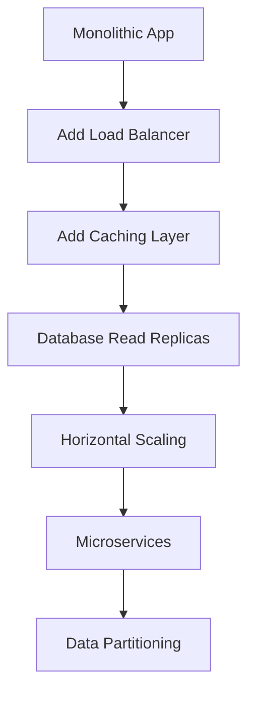

# Scalability Fundamentals 📈

Learn how to design systems that gracefully handle growth from hundreds to millions of users. This section covers the core concepts, patterns, and strategies for building scalable systems.

!!! tip "Quick Navigation"
    This overview covers scalability fundamentals. For detailed implementations and code examples, visit the dedicated sections linked below.

## 🎯 What is Scalability?

Scalability is the ability of a system to handle increased load while maintaining performance, reliability, and cost-effectiveness. It's not just about handling more users - it's about doing so efficiently.

## 🏗️ Types of Scalability

=== "🔗 Horizontal Scaling (Scale Out)"

    **Add more machines to handle increased load**
    
    **Core Concept:**
    Instead of making a single server more powerful, you add more servers to share the workload. Like hiring more workers instead of making one worker work faster.
    
    **How It Works:**
    
    - Multiple identical servers handle requests
    - Load balancer distributes traffic across servers
    - Each server handles a portion of the total load
    - Stateless design allows any server to handle any request
    
    **Real-World Examples:**
    
    - **Netflix**: Thousands of microservices across multiple servers
    - **Amazon**: Millions of requests distributed across server farms
    - **Google Search**: Queries handled by distributed server clusters
    
    **Implementation Patterns:**
    
    - **Load Balancing**: Nginx, HAProxy, AWS ELB
    - **Container Orchestration**: Kubernetes, Docker Swarm
    - **Auto-scaling**: AWS Auto Scaling, Google Cloud Autoscaler
    - **Service Mesh**: Istio, Linkerd for service communication
    
    **Advantages:**
    
    - ✅ **Unlimited Scaling**: Add as many servers as needed
    - ✅ **Fault Tolerance**: If one server fails, others continue
    - ✅ **Cost Effective**: Use commodity hardware instead of expensive servers
    - ✅ **Geographic Distribution**: Servers in multiple regions
    
    **Challenges:**
    
    - ❌ **Complexity**: Distributed system challenges (CAP theorem)
    - ❌ **Data Consistency**: Keeping data synchronized across servers
    - ❌ **Network Latency**: Communication between servers adds overhead
    - ❌ **Session Management**: User sessions must be shared or made stateless
    
    **Best For:**
    
    - Web applications and APIs
    - Stateless microservices
    - Content delivery systems
    - High-traffic consumer applications
    
    **When to Choose:**
    
    - Traffic varies significantly (need elasticity)
    - Global user base requiring low latency
    - Budget constraints (prefer multiple cheap servers)
    - Team needs to scale development across services
    
    **🔍 Learn More**: [Horizontal Scaling Deep Dive →](horizontal-scaling.md)

=== "⬆️ Vertical Scaling (Scale Up)"

    **Add more power (CPU, RAM, storage) to existing machines**
    
    **Core Concept:**

    Make your existing server more powerful instead of adding more servers. Like giving one worker better tools and more energy instead of hiring more workers.
    
    **How It Works:**

    - Upgrade CPU to faster processors or more cores
    - Increase RAM for better performance and caching
    - Add faster storage (SSD, NVMe) for better I/O
    - Improve network bandwidth for faster data transfer
    
    **Real-World Examples:**

    - **Large Databases**: Oracle, SQL Server on powerful hardware
    - **Scientific Computing**: High-performance computing clusters
    - **Financial Trading**: Low-latency systems requiring powerful single machines
    - **Legacy Applications**: Mainframes handling massive workloads
    
    **Implementation Approaches:**

    - **CPU Upgrades**: More cores, faster clock speeds, better architecture
    - **Memory Scaling**: From GB to TB of RAM for large datasets
    - **Storage Optimization**: NVMe SSDs, RAID configurations
    - **Network Enhancement**: 10Gbps, 40Gbps, 100Gbps networking
    
    **Advantages:**

    - ✅ **Simplicity**: No code changes required, just hardware upgrade
    - ✅ **Strong Consistency**: Single machine, no distributed data issues
    - ✅ **Low Latency**: No network communication overhead
    - ✅ **Easier Development**: Simpler architecture and debugging
    
    **Challenges:**

    - ❌ **Hardware Limits**: Physical limits to how powerful one machine can be
    - ❌ **Single Point of Failure**: If the server fails, entire system goes down
    - ❌ **Cost Scaling**: Exponentially more expensive as you scale up
    - ❌ **Downtime**: Upgrades often require system downtime
    
    **Best For:**

    - Database servers (especially ACID-compliant databases)
    - Legacy applications that can't be distributed
    - CPU-intensive applications (mathematical computations)
    - Applications requiring strong consistency
    
    **When to Choose:**

    - Application cannot be easily distributed
    - Strong data consistency is critical
    - Development team lacks distributed systems expertise
    - Predictable, steady workload
    
    **Cost Analysis:**
    ```
    Server Specs    | Cost    | Performance Gain
    ----------------|---------|------------------
    4 CPU, 16GB RAM | $1,000  | Baseline
    8 CPU, 32GB RAM | $2,500  | 2x performance
    16 CPU, 64GB RAM| $8,000  | 3-4x performance
    32 CPU, 128GB   | $25,000 | 5-6x performance
    ```
    
    **🔍 Learn More**: [Vertical Scaling Deep Dive →](vertical-scaling.md)

=== "🎯 Functional Scaling (Microservices)"

    **Split system by business functionality into independent services**
    
    **Core Concept:**
    
    Instead of having one large application doing everything, break it into smaller, specialized services that each handle specific business functions. Like having specialized departments instead of one person doing all jobs.
    
    **How It Works:**
    
    - Decompose monolithic application by business domains
    - Each service owns its data and business logic
    - Services communicate via APIs (REST, gRPC, message queues)
    - Independent deployment and scaling per service
    
    **Real-World Examples:**
    
    - **Amazon**: Separate services for user accounts, product catalog, recommendations, payments
    - **Uber**: Different services for rider app, driver app, mapping, pricing, payments
    - **Netflix**: Services for user management, content delivery, recommendations, billing
    - **Spotify**: Services for music streaming, playlists, social features, discovery
    
    **Service Decomposition Strategies:**
    
    - **Domain-Driven Design**: Organize by business domains
    - **Data Ownership**: Each service owns its database
    - **Team Ownership**: Align services with team boundaries
    - **Scaling Requirements**: Separate services that scale differently
    
    **Advantages:**
    
    - ✅ **Team Independence**: Different teams can work on different services
    - ✅ **Technology Diversity**: Each service can use the best technology for its needs
    - ✅ **Independent Scaling**: Scale only the services that need it
    - ✅ **Fault Isolation**: Failure in one service doesn't bring down the entire system
    - ✅ **Rapid Development**: Smaller codebases are easier to understand and modify
    
    **Challenges:**
    
    - ❌ **Distributed System Complexity**: Network calls, eventual consistency, distributed transactions
    - ❌ **Service Communication**: API versioning, service discovery, circuit breakers
    - ❌ **Data Consistency**: Managing transactions across multiple services
    - ❌ **Operational Overhead**: More services to deploy, monitor, and maintain
    - ❌ **Testing Complexity**: Integration testing across multiple services
    
    **Best For:**
    
    - Large, complex applications
    - Organizations with multiple development teams
    - Systems with different scaling requirements per feature
    - Applications requiring rapid feature development
    
    **When to Choose:**
    
    - Team size > 8-10 developers (Amazon's "two pizza rule")
    - Different parts of system have different scaling needs
    - Need to use different technologies for different features
    - Frequent deployments required
    
    **Migration Strategy:**
    
    ```
    Monolith → Extract one service → Strangler Fig Pattern → Full microservices
    ```
    
    **🔍 Learn More**: [Microservices Architecture →](../distributed-systems/microservices.md)

=== "🗂️ Data Scaling (Partitioning)"

    **Distribute data across multiple databases or storage systems**
    
    **Core Concept:**

    Instead of storing all data in one database, split it across multiple databases based on some partitioning strategy. Like organizing a library into different sections instead of putting all books on one shelf.
    
    **How It Works:**

    - **Horizontal Partitioning (Sharding)**: Split rows across databases
    - **Vertical Partitioning**: Split columns/tables across databases
    - **Functional Partitioning**: Split by feature/domain
    - **Geographic Partitioning**: Split by user location
    
    **Real-World Examples:**

    - **Instagram**: Photos sharded by user ID across multiple databases
    - **WhatsApp**: Messages partitioned by chat ID
    - **LinkedIn**: User profiles sharded by user ID, posts by timeline
    - **Pinterest**: Pins sharded by board ID
    
    **Partitioning Strategies:**
    
    **By Hash:**
    ```
    Shard = hash(user_id) % number_of_shards
    User 12345 → hash(12345) % 4 = Shard 1
    ```
    
    **By Range:**
    ```
    Shard 1: Users 1-1,000,000
    Shard 2: Users 1,000,001-2,000,000
    Shard 3: Users 2,000,001-3,000,000
    ```
    
    **By Directory:**
    ```
    Lookup Service: user_id → shard_location
    User 12345 → Shard 2 (eu-west-1)
    ```
    
    **By Geography:**
    ```
    US Users → US Database
    EU Users → EU Database
    Asia Users → Asia Database
    ```
    
    **Advantages:**

    - ✅ **Handle Massive Datasets**: Distribute data beyond single machine capacity
    - ✅ **Parallel Processing**: Queries can run simultaneously on multiple shards
    - ✅ **Improved Performance**: Smaller datasets per shard = faster queries
    - ✅ **Geographic Optimization**: Data closer to users reduces latency
    - ✅ **Fault Isolation**: Problem in one shard doesn't affect others
    
    **Challenges:**

    - ❌ **Cross-Shard Queries**: Joining data across shards is complex and slow
    - ❌ **Rebalancing**: Adding/removing shards requires data migration
    - ❌ **Hotspots**: Uneven data distribution can overload some shards
    - ❌ **Complexity**: Application logic must be shard-aware
    - ❌ **Transactions**: Distributed transactions across shards are difficult
    
    **Best For:**

    - Very large datasets (> 1TB)
    - High-throughput applications
    - Geographically distributed users
    - Analytics and reporting systems
    
    **When to Choose:**

    - Single database becomes the bottleneck
    - Dataset size exceeds single machine capacity
    - Need to comply with data locality regulations (GDPR)
    - Different data access patterns for different user segments
    
    **Implementation Technologies:**
    
    - **Built-in Sharding**: MongoDB, Cassandra, DynamoDB
    - **Application-level**: Custom sharding logic in application
    - **Middleware**: Vitess (MySQL), Citus (PostgreSQL)
    - **Proxy-based**: ProxySQL, MaxScale
    
    **🔍 Learn More**: [Database Scaling & Sharding →](../data-storage/sharding.md)

## 🎯 Core Scalability Patterns

<div class="grid cards" markdown>

- :material-scale-balance: **[Load Balancing](load-balancing.md)**

    ---

    **Round Robin • Weighted • Least Connections • Consistent Hashing**
    
    Distribute requests efficiently across multiple servers

- :material-cached: **[Caching](../caching/index.md)**

    ---

    **In-Memory • Distributed • CDN • Application-Level**
    
    Store frequently accessed data for faster retrieval

- :material-database-arrow-up: **[Database Scaling](database-scaling.md)**

    ---

    **Read Replicas • Sharding • Partitioning • Federation**
    
    Scale your data layer to handle massive datasets

- :material-auto-fix: **[Auto-scaling](auto-scaling.md)**

    ---

    **Reactive • Predictive • Metrics-Based • Scheduled**
    
    Automatically adjust capacity based on demand

- :material-speedometer: **[Performance Optimization](performance-optimization.md)**

    ---

    **Bottleneck Identification • Resource Tuning • Query Optimization**
    
    Maximize efficiency at every layer of your system

- :material-network-outline: **[Content Delivery](../networking/cdn.md)**

    ---

    **CDN • Edge Computing • Geographic Distribution**
    
    Serve content from locations closest to users

</div>

## 📊 Scalability Metrics

### Key Performance Indicators

| Metric | Description | Target |
|--------|-------------|---------|
| **Throughput** | Requests per second | Based on business needs |
| **Latency** | Response time (P95, P99) | < 100ms for web apps |
| **Availability** | System uptime | 99.9% - 99.99% |
| **Error Rate** | Failed requests percentage | < 0.1% |
| **Resource Utilization** | CPU, Memory, Network usage | 70-80% optimal |

### Scalability Testing

- **Load Testing**: Normal expected traffic
- **Stress Testing**: Beyond normal capacity
- **Spike Testing**: Sudden traffic increases
- **Volume Testing**: Large amounts of data
- **Endurance Testing**: Extended periods

## 🚀 Scalability Strategies

### 1. Start Simple, Scale Smart



### 2. Identify Bottlenecks

**Common Bottlenecks:**
- Database queries and connections
- CPU-intensive operations
- Memory limitations
- Network bandwidth
- Disk I/O operations

**Monitoring Tools:**
- Application Performance Monitoring (APM)
- Database query analyzers
- System resource monitors
- Network traffic analysis

### 3. Design for Statelessness

**Stateless Services Benefits:**
- Easy horizontal scaling
- No session affinity required
- Fault tolerance
- Load balancer flexibility

**State Management:**
- External caches (Redis, Memcached)
- Databases for persistence
- Message queues for temporary state
- Client-side state when appropriate

## ⚖️ Scalability Trade-offs

### Performance vs Cost

- **High Performance**: More expensive but better user experience
- **Cost Optimization**: May sacrifice some performance for budget constraints

### Consistency vs Availability

- **Strong Consistency**: All nodes see same data, may impact availability
- **Eventual Consistency**: Better availability, temporary data inconsistency

### Simplicity vs Scalability

- **Monolithic**: Simple to develop and deploy, limited scaling
- **Microservices**: Complex but highly scalable

## 🛠️ Technology Choices

### Load Balancers

| Technology | Type | Best For |
|------------|------|----------|
| **Nginx** | Software | Web servers, reverse proxy |
| **HAProxy** | Software | TCP/HTTP load balancing |
| **AWS ELB** | Cloud | AWS-hosted applications |
| **Cloudflare** | CDN | Global load balancing |

### Caching Solutions

| Technology | Type | Best For |
|------------|------|----------|
| **Redis** | In-memory | Session storage, real-time data |
| **Memcached** | In-memory | Simple caching |
| **Varnish** | HTTP | Web content caching |
| **CloudFront** | CDN | Static content delivery |

### Database Scaling

| Approach | Technology | Use Case |
|----------|------------|----------|
| **Read Replicas** | PostgreSQL, MySQL | Read-heavy workloads |
| **Sharding** | MongoDB, Cassandra | Massive datasets |
| **NewSQL** | CockroachDB, Spanner | ACID + Scale |
| **NoSQL** | DynamoDB, MongoDB | Flexible schema, high scale |

## 📈 Scaling Roadmap

### Phase 1: Foundation (0-10K users)
- Single server application
- Basic monitoring
- Database optimization
- Simple caching

### Phase 2: Growth (10K-100K users)
- Load balancer
- Database read replicas
- CDN for static content
- Application-level caching

### Phase 3: Scale (100K-1M users)
- Horizontal scaling
- Database sharding
- Microservices (if needed)
- Auto-scaling

### Phase 4: Optimization (1M+ users)
- Advanced caching strategies
- Data partitioning
- Global distribution
- Performance fine-tuning

## ✅ Scalability Best Practices

1. **Measure First**: Don't optimize prematurely
2. **Start Simple**: Add complexity only when needed
3. **Design for Failure**: Everything will fail eventually
4. **Cache Strategically**: Cache at multiple levels
5. **Monitor Everything**: You can't improve what you don't measure
6. **Plan for Growth**: Design with future scale in mind

## 🎯 Next Steps

Ready to dive deeper into specific scalability techniques?

<div class="grid cards" markdown>

- :material-trending-up: **[Horizontal Scaling](horizontal-scaling.md)**

    ---

    Learn to scale out with multiple servers and load balancing

- :material-scale-balance: **[Load Balancing](load-balancing.md)**

    ---

    Master different load balancing algorithms and strategies

- :material-database-arrow-up: **[Database Scaling](database-scaling.md)**

    ---

    Scale your data layer with replicas, sharding, and partitioning

- :material-auto-fix: **[Auto-scaling](auto-scaling.md)**

    ---

    Build systems that automatically scale based on demand

</div>

---

**Scale smart, scale efficiently! 📈💪**
