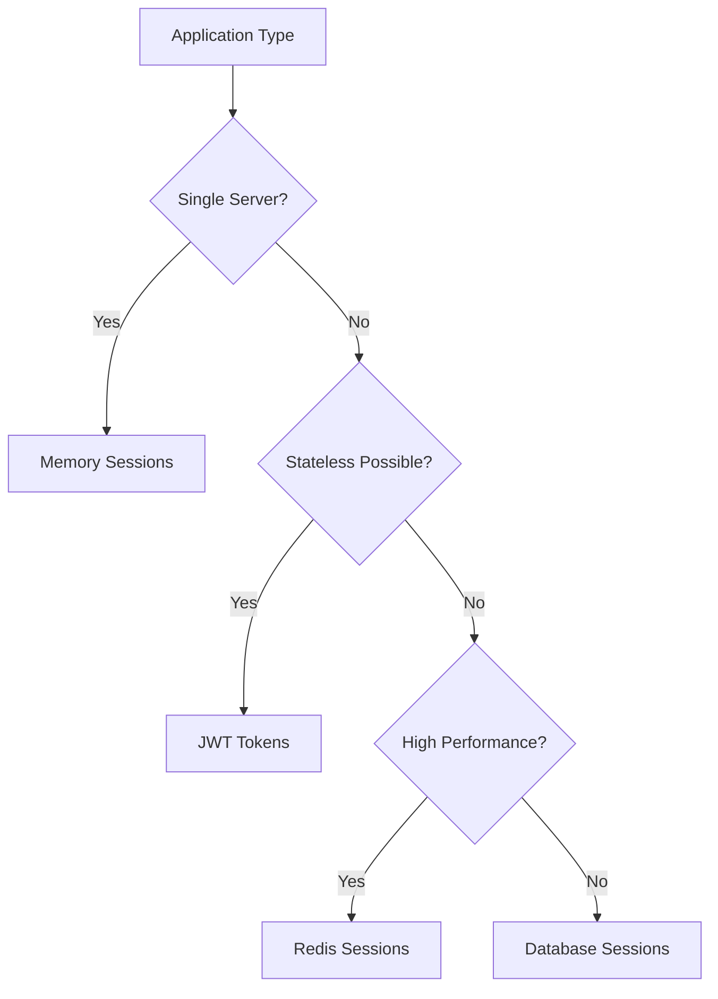

# Session Management & State 🔐

Master session management, stateful/stateless design, and user state persistence strategies.

## 📋 Core Topics

### Session Fundamentals

- **[Session Types](session-types.md)** - Server-side vs client-side sessions
- **[Session Storage](storage.md)** - Memory, database, distributed cache
- **[Session Security](security.md)** - CSRF, XSS, session hijacking protection
- **[Session Lifecycle](lifecycle.md)** - Creation, renewal, expiration, cleanup

### State Management Patterns

- **[Stateless Design](stateless.md)** - JWT tokens, self-contained state
- **[Stateful Design](stateful.md)** - Server-side session management
- **[Hybrid Approaches](hybrid.md)** - Combining stateless and stateful patterns
- **[Sticky Sessions](sticky.md)** - Session affinity in load balancing

### Storage Solutions

- **[Redis Sessions](redis.md)** - High-performance session storage
- **[Database Sessions](database.md)** - Persistent session storage
- **[Cookie Management](cookies.md)** - Client-side state storage
- **[Token-Based Auth](tokens.md)** - JWT and OAuth implementations

### Advanced Concepts

- **[Distributed Sessions](distributed.md)** - Cross-service session sharing
- **[Session Migration](migration.md)** - Moving sessions between servers
- **[SSO Integration](sso.md)** - Single Sign-On implementations
- **[Mobile Sessions](mobile.md)** - Mobile app session strategies

## 🔍 Quick Reference

### Session Storage Comparison

| Storage Type | Performance | Scalability | Persistence | Complexity | Use Case |
|--------------|-------------|-------------|-------------|------------|----------|
| **Memory** | Very High | Low | No | Low | Single server apps |
| **Redis** | High | High | Optional | Medium | Distributed web apps |
| **Database** | Medium | High | Yes | Medium | Enterprise applications |
| **Cookies** | High | Very High | Client-only | Low | Stateless applications |
| **JWT Tokens** | High | Very High | No | Low | APIs and microservices |

### Session Strategy Decision Matrix



## 🛠️ Implementation Examples

### Redis Session Manager

```python
import redis
import json
import uuid
import hashlib
import time
from typing import Dict, Any, Optional
from datetime import datetime, timedelta
import secrets

class RedisSessionManager:
    def __init__(self, 
                 redis_host: str = 'localhost',
                 redis_port: int = 6379,
                 redis_db: int = 0,
                 session_timeout: int = 3600,
                 key_prefix: str = 'session:'):
        
        self.redis_client = redis.Redis(
            host=redis_host,
            port=redis_port,
            db=redis_db,
            decode_responses=True
        )
        self.session_timeout = session_timeout
        self.key_prefix = key_prefix
    
    def create_session(self, user_id: str, user_data: Dict[str, Any] = None) -> str:
        """Create a new session for user"""
        session_id = self._generate_session_id()
        session_key = f"{self.key_prefix}{session_id}"
        
        session_data = {
            'user_id': user_id,
            'created_at': datetime.utcnow().isoformat(),
            'last_activity': datetime.utcnow().isoformat(),
            'user_data': user_data or {},
            'csrf_token': secrets.token_urlsafe(32)
        }
        
        # Store session with expiration
        self.redis_client.setex(
            session_key,
            self.session_timeout,
            json.dumps(session_data)
        )
        
        return session_id
    
    def get_session(self, session_id: str) -> Optional[Dict[str, Any]]:
        """Get session data by session ID"""
        session_key = f"{self.key_prefix}{session_id}"
        
        try:
            session_data = self.redis_client.get(session_key)
            if session_data:
                data = json.loads(session_data)
                
                # Update last activity
                data['last_activity'] = datetime.utcnow().isoformat()
                self.redis_client.setex(
                    session_key,
                    self.session_timeout,
                    json.dumps(data)
                )
                
                return data
            return None
            
        except (redis.RedisError, json.JSONDecodeError):
            return None
    
    def update_session(self, session_id: str, updates: Dict[str, Any]) -> bool:
        """Update session data"""
        session_data = self.get_session(session_id)
        if not session_data:
            return False
        
        # Merge updates
        session_data['user_data'].update(updates)
        session_data['last_activity'] = datetime.utcnow().isoformat()
        
        session_key = f"{self.key_prefix}{session_id}"
        
        try:
            self.redis_client.setex(
                session_key,
                self.session_timeout,
                json.dumps(session_data)
            )
            return True
        except redis.RedisError:
            return False
    
    def delete_session(self, session_id: str) -> bool:
        """Delete session"""
        session_key = f"{self.key_prefix}{session_id}"
        
        try:
            return bool(self.redis_client.delete(session_key))
        except redis.RedisError:
            return False
    
    def refresh_session(self, session_id: str) -> bool:
        """Refresh session timeout"""
        session_key = f"{self.key_prefix}{session_id}"
        
        try:
            return bool(self.redis_client.expire(session_key, self.session_timeout))
        except redis.RedisError:
            return False
    
    def get_user_sessions(self, user_id: str) -> list:
        """Get all active sessions for a user"""
        pattern = f"{self.key_prefix}*"
        sessions = []
        
        try:
            for key in self.redis_client.scan_iter(match=pattern):
                session_data = self.redis_client.get(key)
                if session_data:
                    data = json.loads(session_data)
                    if data.get('user_id') == user_id:
                        session_id = key.replace(self.key_prefix, '')
                        sessions.append({
                            'session_id': session_id,
                            'created_at': data['created_at'],
                            'last_activity': data['last_activity']
                        })
        except (redis.RedisError, json.JSONDecodeError):
            pass
        
        return sessions
    
    def invalidate_all_user_sessions(self, user_id: str) -> int:
        """Invalidate all sessions for a user"""
        user_sessions = self.get_user_sessions(user_id)
        count = 0
        
        for session in user_sessions:
            if self.delete_session(session['session_id']):
                count += 1
        
        return count
    
    def cleanup_expired_sessions(self) -> int:
        """Cleanup expired sessions (Redis handles this automatically with TTL)"""
        # Redis automatically removes expired keys
        # This method exists for interface compatibility
        return 0
    
    def get_session_stats(self) -> Dict[str, Any]:
        """Get session statistics"""
        pattern = f"{self.key_prefix}*"
        active_sessions = 0
        
        try:
            for _ in self.redis_client.scan_iter(match=pattern):
                active_sessions += 1
        except redis.RedisError:
            pass
        
        return {
            'active_sessions': active_sessions,
            'session_timeout': self.session_timeout
        }
    
    def _generate_session_id(self) -> str:
        """Generate secure session ID"""
        # Use cryptographically secure random generator
        random_bytes = secrets.token_bytes(32)
        
        # Add timestamp for uniqueness
        timestamp = str(int(time.time() * 1000000))
        
        # Create hash
        session_data = random_bytes + timestamp.encode()
        return hashlib.sha256(session_data).hexdigest()

# Flask integration example
from flask import Flask, request, jsonify, make_response

class FlaskSessionMiddleware:
    def __init__(self, app: Flask, session_manager: RedisSessionManager):
        self.app = app
        self.session_manager = session_manager
        self.app.before_request(self._load_session)
        self.app.after_request(self._save_session)
    
    def _load_session(self):
        """Load session from cookie"""
        session_id = request.cookies.get('session_id')
        
        if session_id:
            session_data = self.session_manager.get_session(session_id)
            if session_data:
                request.session = session_data
                request.session_id = session_id
                return
        
        # No valid session
        request.session = None
        request.session_id = None
    
    def _save_session(self, response):
        """Save session to cookie"""
        if hasattr(request, 'session_modified') and request.session_modified:
            if request.session_id:
                # Update existing session
                self.session_manager.update_session(
                    request.session_id,
                    request.session.get('user_data', {})
                )
            else:
                # Create new session
                session_id = self.session_manager.create_session(
                    request.session.get('user_id'),
                    request.session.get('user_data', {})
                )
                
                # Set cookie
                response.set_cookie(
                    'session_id',
                    session_id,
                    max_age=self.session_manager.session_timeout,
                    httponly=True,
                    secure=True,  # HTTPS only
                    samesite='Lax'
                )
        
        return response

# Usage example
app = Flask(__name__)
session_manager = RedisSessionManager()
middleware = FlaskSessionMiddleware(app, session_manager)

@app.route('/login', methods=['POST'])
def login():
    data = request.get_json()
    username = data.get('username')
    password = data.get('password')
    
    # Authenticate user (simplified)
    if authenticate_user(username, password):
        user_id = get_user_id(username)
        
        # Create session
        session_id = session_manager.create_session(
            user_id,
            {'username': username, 'login_time': datetime.utcnow().isoformat()}
        )
        
        response = make_response(jsonify({'status': 'success'}))
        response.set_cookie(
            'session_id',
            session_id,
            max_age=session_manager.session_timeout,
            httponly=True,
            secure=True,
            samesite='Lax'
        )
        
        return response
    
    return jsonify({'status': 'error', 'message': 'Invalid credentials'}), 401

@app.route('/logout', methods=['POST'])
def logout():
    session_id = request.cookies.get('session_id')
    
    if session_id:
        session_manager.delete_session(session_id)
    
    response = make_response(jsonify({'status': 'success'}))
    response.set_cookie('session_id', '', expires=0)
    
    return response
```

### JWT Token Implementation

```python
import jwt
import json
from datetime import datetime, timedelta
from typing import Dict, Any, Optional
import secrets

class JWTTokenManager:
    def __init__(self, 
                 secret_key: str,
                 algorithm: str = 'HS256',
                 access_token_lifetime: int = 900,  # 15 minutes
                 refresh_token_lifetime: int = 86400):  # 24 hours
        
        self.secret_key = secret_key
        self.algorithm = algorithm
        self.access_token_lifetime = access_token_lifetime
        self.refresh_token_lifetime = refresh_token_lifetime
        
        # Store for refresh token validation (in production, use Redis)
        self.refresh_tokens: Dict[str, Dict[str, Any]] = {}
    
    def create_tokens(self, user_id: str, user_data: Dict[str, Any] = None) -> Dict[str, str]:
        """Create access and refresh tokens"""
        now = datetime.utcnow()
        
        # Create access token
        access_payload = {
            'user_id': user_id,
            'user_data': user_data or {},
            'token_type': 'access',
            'iat': now,
            'exp': now + timedelta(seconds=self.access_token_lifetime),
            'jti': secrets.token_urlsafe(16)  # JWT ID for uniqueness
        }
        
        access_token = jwt.encode(
            access_payload,
            self.secret_key,
            algorithm=self.algorithm
        )
        
        # Create refresh token
        refresh_jti = secrets.token_urlsafe(32)
        refresh_payload = {
            'user_id': user_id,
            'token_type': 'refresh',
            'iat': now,
            'exp': now + timedelta(seconds=self.refresh_token_lifetime),
            'jti': refresh_jti
        }
        
        refresh_token = jwt.encode(
            refresh_payload,
            self.secret_key,
            algorithm=self.algorithm
        )
        
        # Store refresh token metadata
        self.refresh_tokens[refresh_jti] = {
            'user_id': user_id,
            'created_at': now.isoformat(),
            'is_revoked': False
        }
        
        return {
            'access_token': access_token,
            'refresh_token': refresh_token,
            'token_type': 'Bearer',
            'expires_in': self.access_token_lifetime
        }
    
    def verify_access_token(self, token: str) -> Optional[Dict[str, Any]]:
        """Verify and decode access token"""
        try:
            payload = jwt.decode(
                token,
                self.secret_key,
                algorithms=[self.algorithm]
            )
            
            # Check token type
            if payload.get('token_type') != 'access':
                return None
            
            return payload
            
        except jwt.ExpiredSignatureError:
            return None
        except jwt.InvalidTokenError:
            return None
    
    def verify_refresh_token(self, token: str) -> Optional[Dict[str, Any]]:
        """Verify refresh token"""
        try:
            payload = jwt.decode(
                token,
                self.secret_key,
                algorithms=[self.algorithm]
            )
            
            # Check token type
            if payload.get('token_type') != 'refresh':
                return None
            
            # Check if token is revoked
            jti = payload.get('jti')
            if jti and jti in self.refresh_tokens:
                token_info = self.refresh_tokens[jti]
                if token_info.get('is_revoked'):
                    return None
            
            return payload
            
        except jwt.ExpiredSignatureError:
            return None
        except jwt.InvalidTokenError:
            return None
    
    def refresh_access_token(self, refresh_token: str) -> Optional[Dict[str, str]]:
        """Create new access token using refresh token"""
        refresh_payload = self.verify_refresh_token(refresh_token)
        
        if not refresh_payload:
            return None
        
        user_id = refresh_payload['user_id']
        
        # Create new access token
        now = datetime.utcnow()
        access_payload = {
            'user_id': user_id,
            'user_data': {},  # Could fetch fresh user data here
            'token_type': 'access',
            'iat': now,
            'exp': now + timedelta(seconds=self.access_token_lifetime),
            'jti': secrets.token_urlsafe(16)
        }
        
        access_token = jwt.encode(
            access_payload,
            self.secret_key,
            algorithm=self.algorithm
        )
        
        return {
            'access_token': access_token,
            'token_type': 'Bearer',
            'expires_in': self.access_token_lifetime
        }
    
    def revoke_refresh_token(self, token: str) -> bool:
        """Revoke refresh token"""
        try:
            payload = jwt.decode(
                token,
                self.secret_key,
                algorithms=[self.algorithm]
            )
            
            jti = payload.get('jti')
            if jti and jti in self.refresh_tokens:
                self.refresh_tokens[jti]['is_revoked'] = True
                return True
            
            return False
            
        except jwt.InvalidTokenError:
            return False
    
    def revoke_all_user_tokens(self, user_id: str) -> int:
        """Revoke all refresh tokens for a user"""
        count = 0
        
        for jti, token_info in self.refresh_tokens.items():
            if token_info['user_id'] == user_id and not token_info.get('is_revoked'):
                token_info['is_revoked'] = True
                count += 1
        
        return count
    
    def cleanup_expired_tokens(self) -> int:
        """Remove expired refresh tokens"""
        now = datetime.utcnow()
        expired_tokens = []
        
        for jti, token_info in self.refresh_tokens.items():
            created_at = datetime.fromisoformat(token_info['created_at'])
            if now - created_at > timedelta(seconds=self.refresh_token_lifetime):
                expired_tokens.append(jti)
        
        for jti in expired_tokens:
            del self.refresh_tokens[jti]
        
        return len(expired_tokens)

# JWT Authentication Decorator
from functools import wraps
from flask import request, jsonify

def jwt_required(token_manager: JWTTokenManager):
    """JWT authentication decorator"""
    def decorator(f):
        @wraps(f)
        def decorated_function(*args, **kwargs):
            auth_header = request.headers.get('Authorization')
            
            if not auth_header or not auth_header.startswith('Bearer '):
                return jsonify({'error': 'Missing or invalid authorization header'}), 401
            
            token = auth_header.split(' ')[1]
            payload = token_manager.verify_access_token(token)
            
            if not payload:
                return jsonify({'error': 'Invalid or expired token'}), 401
            
            # Add user info to request context
            request.current_user = {
                'user_id': payload['user_id'],
                'user_data': payload.get('user_data', {})
            }
            
            return f(*args, **kwargs)
        
        return decorated_function
    return decorator

# Usage example with Flask
app = Flask(__name__)
jwt_manager = JWTTokenManager(secret_key='your-secret-key')

@app.route('/auth/login', methods=['POST'])
def jwt_login():
    data = request.get_json()
    username = data.get('username')
    password = data.get('password')
    
    # Authenticate user
    if authenticate_user(username, password):
        user_id = get_user_id(username)
        user_data = {'username': username}
        
        tokens = jwt_manager.create_tokens(user_id, user_data)
        return jsonify(tokens)
    
    return jsonify({'error': 'Invalid credentials'}), 401

@app.route('/auth/refresh', methods=['POST'])
def jwt_refresh():
    data = request.get_json()
    refresh_token = data.get('refresh_token')
    
    if not refresh_token:
        return jsonify({'error': 'Refresh token required'}), 400
    
    new_tokens = jwt_manager.refresh_access_token(refresh_token)
    
    if new_tokens:
        return jsonify(new_tokens)
    
    return jsonify({'error': 'Invalid refresh token'}), 401

@app.route('/auth/logout', methods=['POST'])
@jwt_required(jwt_manager)
def jwt_logout():
    data = request.get_json()
    refresh_token = data.get('refresh_token')
    
    if refresh_token:
        jwt_manager.revoke_refresh_token(refresh_token)
    
    return jsonify({'message': 'Logged out successfully'})

@app.route('/protected', methods=['GET'])
@jwt_required(jwt_manager)
def protected_route():
    user = request.current_user
    return jsonify({
        'message': f'Hello {user["user_data"]["username"]}!',
        'user_id': user['user_id']
    })
```

### Database Session Implementation

```python
import sqlite3
import json
import uuid
import hashlib
import time
from typing import Dict, Any, Optional
from datetime import datetime, timedelta

class DatabaseSessionManager:
    def __init__(self, db_path: str = 'sessions.db', session_timeout: int = 3600):
        self.db_path = db_path
        self.session_timeout = session_timeout
        self._init_database()
    
    def _init_database(self):
        """Initialize session database"""
        with sqlite3.connect(self.db_path) as conn:
            conn.execute('''
                CREATE TABLE IF NOT EXISTS sessions (
                    session_id TEXT PRIMARY KEY,
                    user_id TEXT NOT NULL,
                    session_data TEXT NOT NULL,
                    created_at TIMESTAMP NOT NULL,
                    last_activity TIMESTAMP NOT NULL,
                    expires_at TIMESTAMP NOT NULL
                )
            ''')
            
            # Create index for cleanup
            conn.execute('''
                CREATE INDEX IF NOT EXISTS idx_sessions_expires_at 
                ON sessions(expires_at)
            ''')
            
            conn.execute('''
                CREATE INDEX IF NOT EXISTS idx_sessions_user_id 
                ON sessions(user_id)
            ''')
    
    def create_session(self, user_id: str, user_data: Dict[str, Any] = None) -> str:
        """Create new session"""
        session_id = self._generate_session_id()
        now = datetime.utcnow()
        expires_at = now + timedelta(seconds=self.session_timeout)
        
        session_data = {
            'user_data': user_data or {},
            'csrf_token': uuid.uuid4().hex
        }
        
        with sqlite3.connect(self.db_path) as conn:
            conn.execute('''
                INSERT INTO sessions 
                (session_id, user_id, session_data, created_at, last_activity, expires_at)
                VALUES (?, ?, ?, ?, ?, ?)
            ''', (
                session_id,
                user_id,
                json.dumps(session_data),
                now,
                now,
                expires_at
            ))
        
        return session_id
    
    def get_session(self, session_id: str) -> Optional[Dict[str, Any]]:
        """Get session data"""
        with sqlite3.connect(self.db_path) as conn:
            conn.row_factory = sqlite3.Row
            cursor = conn.execute('''
                SELECT * FROM sessions 
                WHERE session_id = ? AND expires_at > ?
            ''', (session_id, datetime.utcnow()))
            
            row = cursor.fetchone()
            
            if row:
                # Update last activity
                now = datetime.utcnow()
                new_expires_at = now + timedelta(seconds=self.session_timeout)
                
                conn.execute('''
                    UPDATE sessions 
                    SET last_activity = ?, expires_at = ?
                    WHERE session_id = ?
                ''', (now, new_expires_at, session_id))
                
                session_data = json.loads(row['session_data'])
                return {
                    'session_id': row['session_id'],
                    'user_id': row['user_id'],
                    'created_at': row['created_at'],
                    'last_activity': now.isoformat(),
                    **session_data
                }
        
        return None
    
    def update_session(self, session_id: str, updates: Dict[str, Any]) -> bool:
        """Update session data"""
        session = self.get_session(session_id)
        if not session:
            return False
        
        # Merge updates
        session_data = {
            'user_data': {**session.get('user_data', {}), **updates},
            'csrf_token': session.get('csrf_token')
        }
        
        with sqlite3.connect(self.db_path) as conn:
            conn.execute('''
                UPDATE sessions 
                SET session_data = ?, last_activity = ?
                WHERE session_id = ?
            ''', (
                json.dumps(session_data),
                datetime.utcnow(),
                session_id
            ))
        
        return True
    
    def delete_session(self, session_id: str) -> bool:
        """Delete session"""
        with sqlite3.connect(self.db_path) as conn:
            cursor = conn.execute('''
                DELETE FROM sessions WHERE session_id = ?
            ''', (session_id,))
            
            return cursor.rowcount > 0
    
    def get_user_sessions(self, user_id: str) -> list:
        """Get all active sessions for user"""
        with sqlite3.connect(self.db_path) as conn:
            conn.row_factory = sqlite3.Row
            cursor = conn.execute('''
                SELECT session_id, created_at, last_activity 
                FROM sessions 
                WHERE user_id = ? AND expires_at > ?
                ORDER BY last_activity DESC
            ''', (user_id, datetime.utcnow()))
            
            return [dict(row) for row in cursor.fetchall()]
    
    def invalidate_all_user_sessions(self, user_id: str) -> int:
        """Invalidate all sessions for user"""
        with sqlite3.connect(self.db_path) as conn:
            cursor = conn.execute('''
                DELETE FROM sessions WHERE user_id = ?
            ''', (user_id,))
            
            return cursor.rowcount
    
    def cleanup_expired_sessions(self) -> int:
        """Remove expired sessions"""
        with sqlite3.connect(self.db_path) as conn:
            cursor = conn.execute('''
                DELETE FROM sessions WHERE expires_at <= ?
            ''', (datetime.utcnow(),))
            
            return cursor.rowcount
    
    def get_session_stats(self) -> Dict[str, Any]:
        """Get session statistics"""
        with sqlite3.connect(self.db_path) as conn:
            cursor = conn.execute('''
                SELECT COUNT(*) as active_sessions,
                       COUNT(DISTINCT user_id) as unique_users
                FROM sessions 
                WHERE expires_at > ?
            ''', (datetime.utcnow(),))
            
            row = cursor.fetchone()
            
            return {
                'active_sessions': row[0],
                'unique_users': row[1],
                'session_timeout': self.session_timeout
            }
    
    def _generate_session_id(self) -> str:
        """Generate secure session ID"""
        random_data = uuid.uuid4().bytes + str(time.time()).encode()
        return hashlib.sha256(random_data).hexdigest()
```

## 📊 Session Monitoring and Security

### Session Security Implementation

```python
import hmac
import hashlib
from datetime import datetime, timedelta
from typing import Dict, Any

class SessionSecurity:
    def __init__(self, secret_key: str):
        self.secret_key = secret_key
    
    def generate_csrf_token(self, session_id: str) -> str:
        """Generate CSRF token for session"""
        timestamp = str(int(datetime.utcnow().timestamp()))
        message = f"{session_id}:{timestamp}"
        
        signature = hmac.new(
            self.secret_key.encode(),
            message.encode(),
            hashlib.sha256
        ).hexdigest()
        
        return f"{timestamp}:{signature}"
    
    def validate_csrf_token(self, session_id: str, token: str, max_age: int = 3600) -> bool:
        """Validate CSRF token"""
        try:
            timestamp_str, signature = token.split(':', 1)
            timestamp = int(timestamp_str)
            
            # Check if token is not too old
            if datetime.utcnow().timestamp() - timestamp > max_age:
                return False
            
            # Regenerate expected signature
            message = f"{session_id}:{timestamp_str}"
            expected_signature = hmac.new(
                self.secret_key.encode(),
                message.encode(),
                hashlib.sha256
            ).hexdigest()
            
            # Constant-time comparison
            return hmac.compare_digest(signature, expected_signature)
            
        except (ValueError, TypeError):
            return False
    
    def detect_session_anomalies(self, 
                                session_data: Dict[str, Any],
                                current_ip: str,
                                current_user_agent: str) -> list:
        """Detect potential session security issues"""
        anomalies = []
        
        # IP address change detection
        last_ip = session_data.get('last_ip')
        if last_ip and last_ip != current_ip:
            anomalies.append({
                'type': 'ip_change',
                'message': f'IP changed from {last_ip} to {current_ip}',
                'severity': 'medium'
            })
        
        # User agent change detection
        last_user_agent = session_data.get('last_user_agent')
        if last_user_agent and last_user_agent != current_user_agent:
            anomalies.append({
                'type': 'user_agent_change',
                'message': 'User agent changed',
                'severity': 'low'
            })
        
        # Session duration check
        created_at = session_data.get('created_at')
        if created_at:
            session_age = datetime.utcnow() - datetime.fromisoformat(created_at)
            if session_age > timedelta(hours=24):
                anomalies.append({
                    'type': 'long_session',
                    'message': f'Session active for {session_age}',
                    'severity': 'low'
                })
        
        return anomalies
```

## 🎯 Best Practices

### Session Security Guidelines

- [ ] **Use HTTPS only** for session cookies
- [ ] **Set HttpOnly flag** to prevent XSS attacks
- [ ] **Use SameSite attribute** to prevent CSRF
- [ ] **Implement session timeout** appropriate for your use case
- [ ] **Regenerate session ID** after login
- [ ] **Validate session integrity** on each request
- [ ] **Monitor for suspicious activity** (IP changes, etc.)
- [ ] **Implement logout functionality** that clears sessions

### Performance Considerations

- [ ] **Choose appropriate storage** based on scale
- [ ] **Implement session cleanup** to prevent storage bloat
- [ ] **Use connection pooling** for database sessions
- [ ] **Consider session partitioning** for large systems
- [ ] **Monitor session storage metrics**
- [ ] **Implement graceful degradation** for storage failures
- [ ] **Use sticky sessions** when beneficial
- [ ] **Cache frequently accessed session data**

## 🔗 Related Topics

- [Authentication](../reliability-security/authentication.md) - User authentication patterns
- [Caching](../caching/index.md) - Session storage optimization
- [Load Balancing](../load-balancing/index.md) - Session affinity considerations
- [Security](../reliability-security/index.md) - Overall security practices
- [Microservices](../distributed-systems/microservices.md) - Distributed session management

## 📚 Additional Resources

- [OWASP Session Management](https://owasp.org/www-project-cheat-sheets/cheatsheets/Session_Management_Cheat_Sheet.html) - Security best practices
- [JWT Introduction](https://jwt.io/introduction/) - JSON Web Token guide
- [Redis Session Store](https://redis.io/docs/manual/keyspace-notifications/) - Redis for sessions
- [Flask-Session](https://flask-session.readthedocs.io/) - Flask session management
